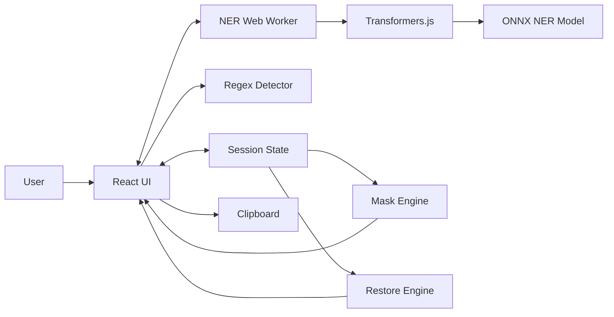
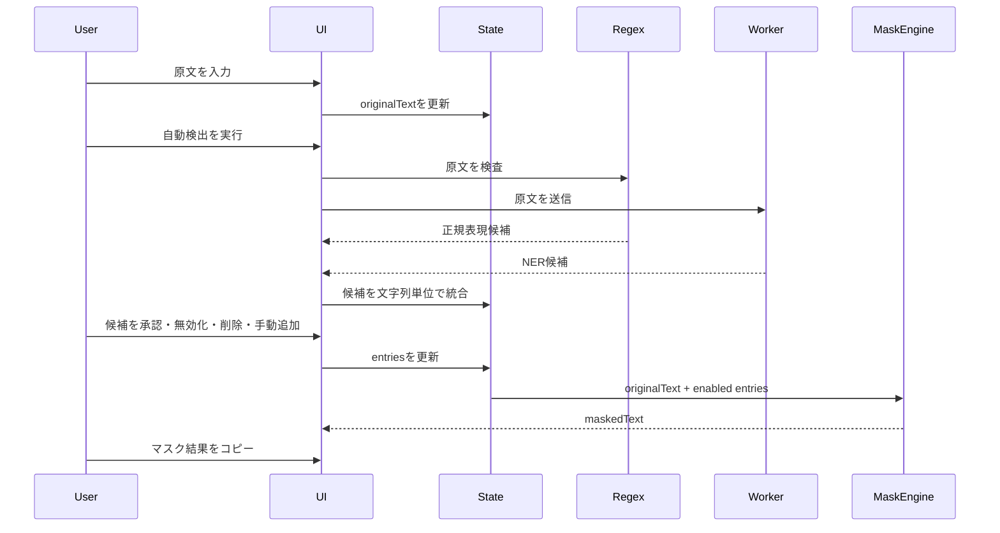
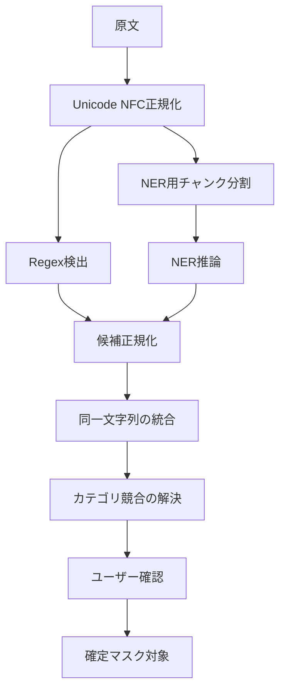
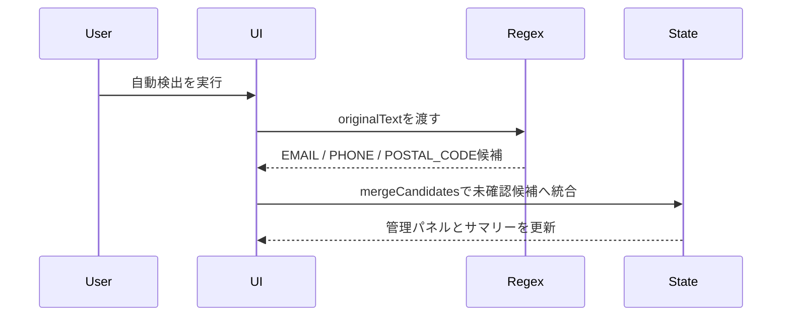
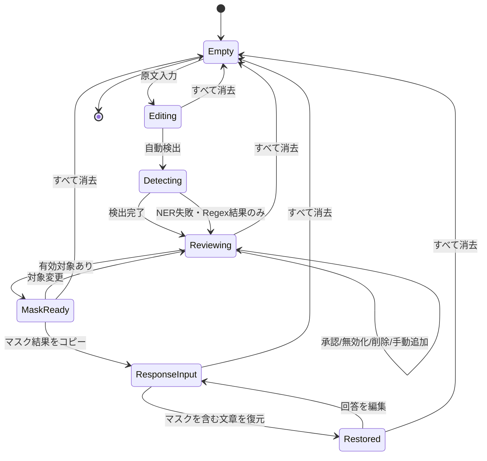

# Local PII Masker アーキテクチャ方針

## 1. 目的

本書は、MVP要件を実装へ落とし込むための論理構成、状態管理、マスキング処理、AI推論、データ保持境界を定義する。

MVPでは、ユーザーデータをブラウザメモリ内だけに保持し、原文を正本としてマスク結果を都度生成する。

## 2. 設計原則

1. **原文を正本とする**  
   マスク結果に対して追加置換を行わず、常に原文と有効なマスク対象一覧から再生成する。

2. **検出と確定を分離する**  
   正規表現・NERの出力は候補であり、確定済みマスク対象とは別に扱う。

3. **ユーザーデータを永続化しない**  
   原文、検出結果、対応表、マスクを含む文章をLocalStorage、SessionStorage、IndexedDB、Cookie、サーバーへ保存しない。

4. **AIが利用できなくても基本操作を維持する**  
   NERモデルの取得・初期化に失敗しても、原文入力、手動追加、正規表現検出、マスク生成は利用可能とする。

5. **長時間処理をUIスレッドから分離する**  
   NERのロードと推論はWeb Workerで実行する構成を基本とする。

6. **復元可能性を過大評価しない**  
   復元できるのは、マスクを含む文章中に完全な形で残っている既知トークンだけとする。

## 3. 論理構成



### 3.1 UI層

- 原文入力
- 検出開始・進行表示
- 候補一覧
- 手動追加
- 原文／マスク結果の表示切り替え
- マスク済みテキストのコピー
- マスクを含む文章の入力
- マスクを復元した文章とトークン検査結果の表示
- セッション消去

### 3.2 セッション状態層

- 原文
- 検出候補・マスク対象
- トークン対応表
- マスクを含む文章
- モデル状態
- UI状態

状態はReactコンポーネントへ分散させず、`useReducer`または同等の一方向データフローで管理する。

### 3.3 検出層

- Regex Detector：形式が明確な候補を同期または短時間で検出
- NER Worker：人名、地名・住所、組織名などを非同期検出
- Candidate Merger：同一文字列を統合し、検出元情報を保持

### 3.4 変換層

- Mask Engine：原文と有効な対象からマスク結果を生成
- Restore Engine：マスクを含む文章内の既知トークンを元文字列へ置換
- Token Inspector：既知、不明、未出現トークンを分類

## 4. データフロー



原文はNER Workerへ渡す必要があるが、同一ブラウザ内のWorkerメッセージに限定し、ネットワーク送信は行わない。

## 5. 状態モデル

```ts
export type MaskCategory =
  | "PERSON"
  | "ADDRESS"
  | "ORGANIZATION"
  | "PHONE"
  | "EMAIL"
  | "POSTAL_CODE"
  | "SECRET"
  | "OTHER";

export type DetectionSource = "regex" | "ner" | "manual";

export type CandidateStatus = "pending" | "accepted" | "rejected";

export type MaskEntry = {
  id: string;
  originalText: string;
  token: string;
  category: MaskCategory;
  sources: DetectionSource[];
  confidence?: number;
  status: CandidateStatus;
  enabled: boolean;
  occurrenceCount: number;
};

export type ModelStatus =
  | { state: "idle" }
  | { state: "downloading"; progress?: number }
  | { state: "loading" }
  | { state: "ready"; backend: "webgpu" | "wasm" }
  | { state: "error"; code: string };

export type MaskSessionState = {
  originalText: string;
  entries: MaskEntry[];
  externalResponse: string;
  modelStatus: ModelStatus;
  activeTextView: "original" | "masked";
};
```

以下は派生データとしてセレクタまたは純粋関数から生成する。

- `maskedText`
- `restoredResponse`
- 総置換箇所数
- 出現数0のマスク対象
- 既知・不明・未出現トークンの検査結果

## 6. 文字列の同一性

MVPでは登録キーを正規化後の文字列とする。

```ts
function normalizeInput(value: string): string {
  return value.normalize("NFC");
}
```

以下は区別する。

- 大文字と小文字
- 全角と半角
- 空白の有無
- 改行の有無

候補統合用のキーは、原則として次とする。

```ts
const entryKey = `${category}:${normalizedOriginalText}`;
```

ただし、同じ文字列が異なるカテゴリで検出された場合は、UIで競合を提示し、ユーザーが最終カテゴリを選択する。

## 7. マスクアルゴリズム

### 7.1 要件

- 同一文字列の全出現箇所へ適用する
- 包含関係にある対象を両方登録できる
- 同じ位置では最長一致を採用する
- 原文から1回の走査で生成する
- トークンへ置換済みの文字列を再入力にしない

### 7.2 基本方式

MVPでは対象数が限定的であることを前提に、長さ降順で候補を評価する最長一致走査から開始する。

```ts
type ActiveMask = Pick<MaskEntry, "originalText" | "token">;

export function maskText(text: string, entries: ActiveMask[]): string {
  const sorted = [...entries]
    .filter((entry) => entry.originalText.length > 0)
    .sort((a, b) => b.originalText.length - a.originalText.length);

  let output = "";
  let position = 0;

  while (position < text.length) {
    const matched = sorted.find((entry) =>
      text.startsWith(entry.originalText, position),
    );

    if (matched) {
      output += matched.token;
      position += matched.originalText.length;
      continue;
    }

    const codePoint = String.fromCodePoint(text.codePointAt(position)!);
    output += codePoint;
    position += codePoint.length;
  }

  return output;
}
```

対象数や原文長によって性能が不足する場合は、TrieまたはAho-Corasick法への置き換えを検討する。アルゴリズム変更後も、同じ受入テストを維持する。

### 7.3 同長候補の競合

同じ開始位置で同じ長さの異なる候補が一致することは、文字列単位の管理では通常発生しない。カテゴリ競合は候補統合時に解消し、同一文字列へ複数トークンを割り当てない。

## 8. トークン設計

### 8.1 要件

- 原文中の通常文字列と衝突しにくい
- セッション内で一意
- カテゴリを識別できる
- 外部AIによる分割・装飾・翻訳が起きにくい
- 正規表現で厳密に検出できる

初期候補：

```text
[[MASK_PERSON_A7F31C]]
[[MASK_ADDRESS_19B204]]
```

想定パターン：

```regex
\[\[MASK_[A-Z_]+_[A-F0-9]{6,}\]\]
```

連番だけでは、複数セッションの文章を混在させた場合や原文との衝突が起こりやすいため、ランダム識別子を含める。

`crypto.randomUUID()`または`crypto.getRandomValues()`を使用し、暗号用途ではなく衝突回避用途として利用する。

## 9. 検出パイプライン



### 9.1 正規表現検出

各検出器を独立した純粋関数として実装する。

```ts
type Detection = {
  text: string;
  category: MaskCategory;
  start: number;
  end: number;
  source: "regex";
};

type RegexDetector = (text: string) => Detection[];
```

検出器例：

- `detectEmails`
- `detectPhoneNumbers`
- `detectPostalCodes`

検出後に形式検査を追加し、単純な正規表現一致だけに依存しない。

Phase 2では以下の責務分割で実装する。

```text
domain/detection/regex/
├─ detectEmails.ts
├─ detectPhoneNumbers.ts
├─ detectPostalCodes.ts
└─ runRegexDetection.ts
```

| 検出器 | カテゴリ | 主な検査 |
| --- | --- | --- |
| `detectEmails` | `EMAIL` | `@`の前後に有効な文字列があり、ドメイン部に区切りとTLD相当の文字列がある |
| `detectPhoneNumbers` | `PHONE` | 数字数、区切り位置、国内電話番号として過度に短すぎない・長すぎないことを検査する |
| `detectPostalCodes` | `POSTAL_CODE` | `〒`の有無にかかわらず、3桁-4桁相当の郵便番号形式を検査する |

実装上の共通ルールは以下とする。

- 検出器はブラウザAPIやReact stateに依存しない純粋関数とする
- 入力テキストは既存のNFC正規化方針に従う。検出位置を扱う場合は、候補文字列と`start`、`end`が原文上の範囲と対応していることを保証できる範囲だけを候補にする
- 検出結果には`start`、`end`を含め、後続のハイライトや該当箇所移動に利用できるようにする
- 末尾の句読点、閉じ括弧、引用符などを候補本体に含めないため、検出後に範囲をtrimする
- 同じ検出器内で重複した範囲が出た場合は、同一`text + category + start + end`を1件へまとめる
- 複数検出器の結果は`mergeCandidates`へ渡し、同じ文字列の既存候補または手動追加項目へ統合する
- 既存項目と同じ文字列を検出した場合は、既存のカテゴリ、有効状態、トークンを上書きせず、`sources`に`regex`を追加する
- Regex検出はユーザーデータを外部へ送信せず、検出文字列をログへ出力しない

Phase 2の自動検出フローは以下とする。



Regex候補は`reviewStatus: "unreviewed"`、`enabled: false`で登録する。承認操作により`reviewStatus: "approved"`、`enabled: true`へ変更され、既存のマスクエンジンでマスク結果へ反映する。

### 9.2 NER検出

Transformers.jsの`token-classification`パイプラインを使用する。モデル固有のサブワード出力を、連続したエンティティ単位へ再構成する処理が必要となる。

評価項目：

- `B-`、`I-`形式またはモデル固有ラベルの統合
- サブワード境界の結合
- 元文章の文字位置へのマッピング
- チャンク境界で分割された固有表現の扱い
- 信頼度の集約方法

## 10. 長文チャンク分割

NERモデルには最大トークン長があるため、長文を分割する。

MVPでは次の順に評価する。

1. 句点、改行などの自然な境界で分割
2. 上限を超える部分のみトークン単位で分割
3. チャンク間にオーバーラップを設ける
4. 重複検出結果を元文章の位置で統合する

分割値はモデル評価後に確定する。固定文字数だけで分割すると、日本語固有表現を境界で切断するため、文章境界とトークナイザー上限を併用する。

## 11. Web Worker

### 11.1 Workerへ送るデータ

- 推論要求ID
- 正規化済み原文またはチャンク
- モデル設定

### 11.2 Workerから返すデータ

- モデル取得・初期化進捗
- 推論結果
- バックエンド情報
- 原文を含まないエラーコード

### 11.3 メッセージ例

```ts
type WorkerRequest =
  | { type: "LOAD_MODEL"; modelId: string; dtype?: string }
  | { type: "DETECT"; requestId: string; text: string }
  | { type: "CANCEL"; requestId: string };

type WorkerResponse =
  | { type: "MODEL_PROGRESS"; progress?: number }
  | { type: "MODEL_READY"; backend: "webgpu" | "wasm" }
  | { type: "DETECTION_RESULT"; requestId: string; entities: unknown[] }
  | { type: "ERROR"; requestId?: string; code: string };
```

エラー通知へ原文、検出文字列、モデル出力全体を含めない。

## 12. モデル資材とセッションデータの境界

| データ | メモリ保持 | ブラウザキャッシュ | サーバー送信 |
| --- | --- | --- | --- |
| 原文 | 可 | 不可 | 不可 |
| 検出候補 | 可 | 不可 | 不可 |
| マスク対象・対応表 | 可 | 不可 | 不可 |
| マスクを含む文章・マスクを復元した文章 | 可 | 不可 | 不可 |
| JavaScript/CSS | 可 | 可 | 取得時のみ |
| ONNXモデル | 可 | 可 | 取得時のみ |
| トークナイザー資材 | 可 | 可 | 取得時のみ |

「セッションモード」はユーザーデータの保存方針を指す。公開モデル資材まで毎回破棄することは要求しない。

## 13. ネットワーク境界

MVPで許容するネットワーク通信：

- HTML、JavaScript、CSSなどのアプリ資材取得
- NERモデル、設定、トークナイザー資材の取得

許容しない通信：

- 原文の送信
- 検出結果の送信
- マスク対象・対応表の送信
- マスクを含む文章・マスクを復元した文章の送信
- 入力値を含むアクセス解析・エラー通知

将来的にはモデルを同一オリジンで配信する案を評価する。MVP初期はHugging Face Hubからの取得も候補とするが、通信先をUIとドキュメントで明示する。

## 14. UI状態遷移



モデル状態はこの画面状態とは独立して管理し、モデルが未準備でも手動操作を可能とする。

## 15. エラー設計

エラーは、ユーザーデータを含まないコードと一般化したメッセージで管理する。

| コード例 | 内容 | 復旧方針 |
| --- | --- | --- |
| `MODEL_DOWNLOAD_FAILED` | モデル取得失敗 | 再試行、Regex・手動のみで継続 |
| `MODEL_INIT_FAILED` | モデル初期化失敗 | WASMフォールバックまたは再試行 |
| `INFERENCE_FAILED` | 推論失敗 | 原文と設定を保持し再実行 |
| `INPUT_TOO_LARGE` | 上限超過 | 文字数と上限を表示 |
| `CLIPBOARD_DENIED` | コピー権限拒否 | 手動選択・コピーを案内 |
| `INVALID_SELECTION` | 手動選択が空 | 選択し直しを案内 |

ログへ原文、候補文字列、マスクを復元した文章を出力しない。

## 16. ディレクトリ構成案

```text
src/
├─ app/
│  ├─ App.tsx
│  ├─ reducer.ts
│  └─ selectors.ts
├─ components/
│  ├─ TextWorkspace/
│  ├─ EntityPanel/
│  ├─ ModelStatus/
│  └─ RestoreWorkspace/
├─ domain/
│  ├─ mask/
│  │  ├─ maskText.ts
│  │  ├─ restoreText.ts
│  │  ├─ inspectTokens.ts
│  │  └─ tokenFactory.ts
│  ├─ detection/
│  │  ├─ mergeCandidates.ts
│  │  ├─ regex/
│  │  └─ types.ts
│  └─ normalization/
├─ workers/
│  ├─ ner.worker.ts
│  └─ messages.ts
├─ hooks/
└─ tests/
```

ドメインロジックをReactコンポーネントから分離し、純粋関数として単体テスト可能にする。

## 17. 実装フェーズ

### Phase 1：マスキングコア

- セッション状態
- 手動追加
- 同一文字列の全件適用
- 最長一致
- 原文／マスク結果切り替え
- コピー
- 単体テスト

### Phase 2：構造化PII検出

- メールアドレス
- 電話番号
- 郵便番号
- 候補統合と確認UI
- Regex候補の未確認・無効初期状態
- 手動追加済み項目との重複統合
- 再検出時の冪等性
- 形式検出のみの進行表示と完了メッセージ
- Regex候補の単体・結合テスト

テスト観点：

- 機能観点：メールアドレス、電話番号、郵便番号を検出し、未確認候補として追加できること
- 非機能観点：検出時にユーザーテキストをネットワーク、ストレージ、コンソールへ出さないこと
- データ観点：半角・全角、句読点付き、複数出現、既存手動項目との重複、0件化後の再検出を確認すること
- UI観点：自動検出ボタン、進行表示、完了トースト、候補カード、承認・無効化・削除操作、キーボード操作を確認すること
- 正常系：3カテゴリすべてが検出され、承認後に全出現箇所がマスクされること
- 異常系：候補0件、検出器例外、原文変更後の再検出でも既存設定を失わないこと
- 境界値：メール末尾の句読点、電話番号の桁数不足・過剰、郵便番号のハイフン有無、全角数字を確認すること
- 状態遷移：未確認から有効、有効から無効、無効から有効、削除、再検出による検出元追加を確認すること

### Phase 3：ローカルNER

- Web Worker
- モデル取得・進捗表示
- 日本語NER
- 長文チャンク分割
- 信頼度表示

### Phase 4：マスク復元

- マスクを含む文章の入力
- 既知トークン復元
- 既知、不明、未出現トークン検査
- マスクを復元した文章のコピー

### Phase 5：ハードニング

- CSP
- ネットワーク送信検査
- ブラウザ互換性
- 性能測定
- アクセシビリティ

## 18. 初期アーキテクチャ決定

| ID | 決定 |
| --- | --- |
| ADR-001 | 原文を正本とし、マスク結果は派生データとする |
| ADR-002 | 同一文字列は全出現箇所へ一括適用する |
| ADR-003 | 包含関係は許可し、重複位置では最長一致を採用する |
| ADR-004 | ユーザーデータを永続保存しない |
| ADR-005 | NER推論をWeb Workerへ分離する |
| ADR-006 | NER失敗時もRegexと手動追加で継続可能にする |
| ADR-007 | 外部生成AIとはコピー＆ペーストで連携する |
| ADR-008 | 復元対象は完全な形で残った既知トークンに限定する |
