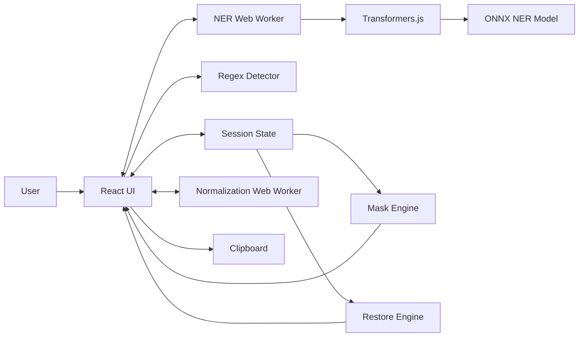
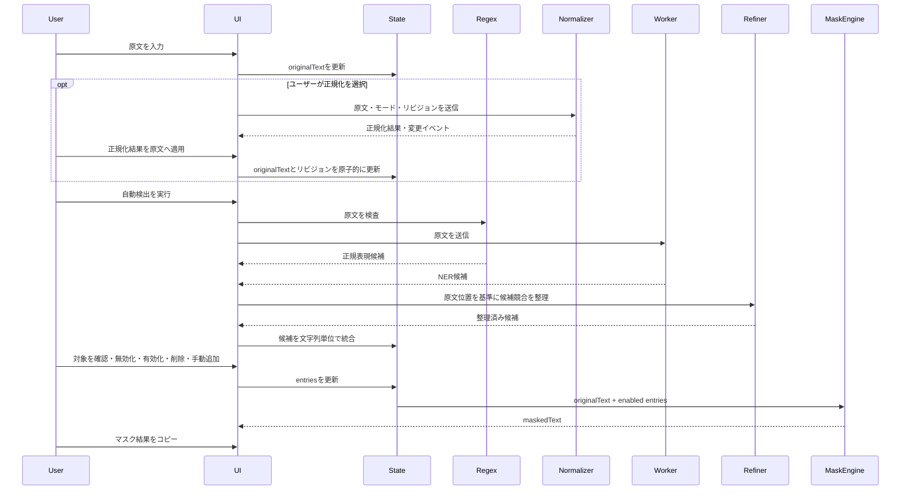
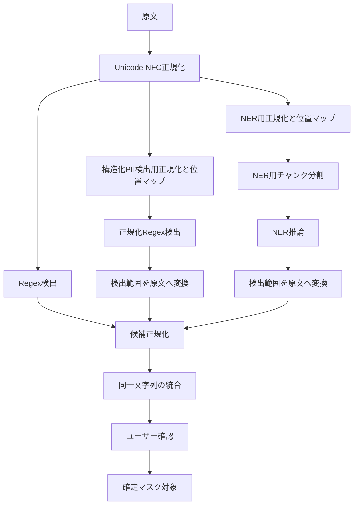
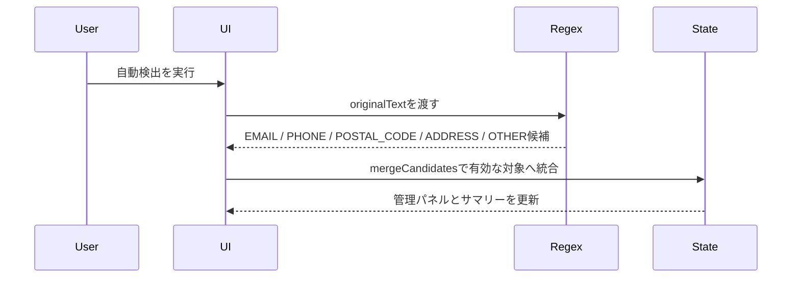
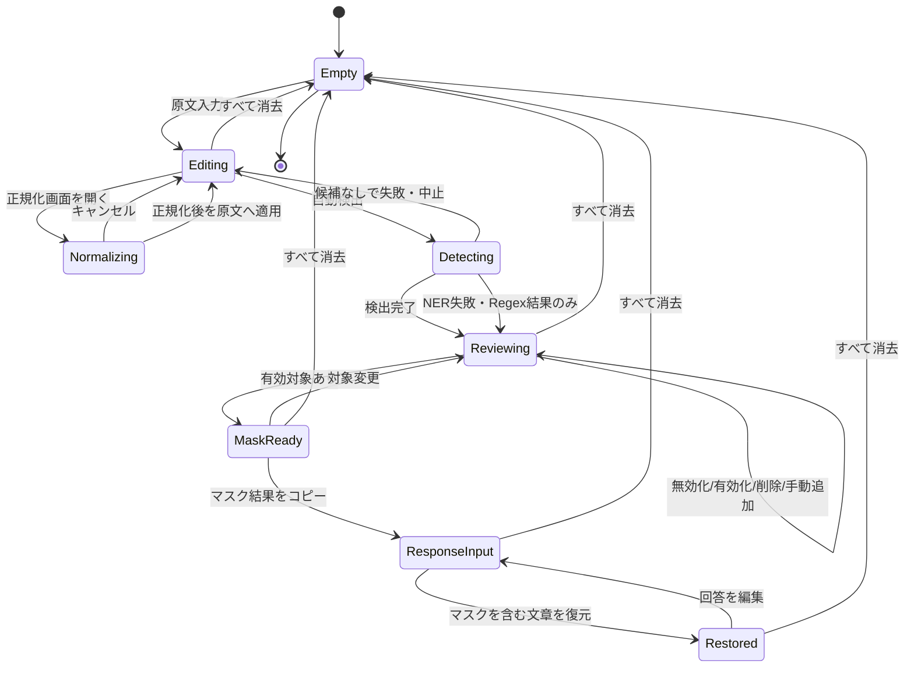

# Local PII Masker アーキテクチャ方針

## 1. 目的

本書は、MVP要件を実装へ落とし込むための論理構成、状態管理、マスキング処理、AI推論、データ保持境界を定義する。

MVPでは、ユーザーデータをブラウザメモリ内だけに保持し、原文を正本としてマスク結果を都度生成する。

## 2. 設計原則

1. **原文を正本とする**  
   マスク結果に対して追加置換を行わず、常に原文と有効なマスク対象一覧から再生成する。

2. **検出と確定を分離する**  
   正規表現・NERの出力は候補であり、確定済みマスク対象とは別に扱う。

3. **ユーザーデータを永続化しない**  
   原文、検出結果、対応表、マスクを含む文章をLocalStorage、SessionStorage、IndexedDB、Cookie、サーバーへ保存しない。

4. **AIが利用できなくても基本操作を維持する**  
   NERモデルの取得・初期化に失敗しても、原文入力、手動追加、正規表現検出、マスク生成は利用可能とする。

5. **長時間処理をUIスレッドから分離する**  
   NERのロードと推論はWeb Workerで実行する構成を基本とする。

6. **復元可能性を過大評価しない**  
   復元できるのは、マスクを含む文章中に完全な形で残っている既知トークンだけとする。

7. **原文を書き換える正規化は明示操作に限定する**
   マスキング前テキスト正規化はプレビューと明示適用を必須とし、適用後のテキストを新しい原文の正本とする。検出完了または手動追加後は全消去まで再適用しない。

## 3. 論理構成



### 3.1 UI層

- CodeMirrorによる原文入力と同一描画面上の候補背景色表示
- 検出開始・進行表示
- 候補一覧
- 手動追加
- 原文／マスク結果の表示切り替え
- マスク済みテキストのコピー
- マスクを含む文章の入力
- マスクを復元した文章とトークン検査結果の表示
- セッション消去
- マスキング前テキスト正規化の起動、前後確認、適用
- 曖昧姓に対する文脈付き出現箇所マスク方式の固定適用

### 3.2 セッション状態層

- 原文
- 検出候補・マスク対象
- トークン対応表
- マスクを含む文章
- モデル状態
- UI状態
- 原文リビジョン
- 正規化ロック理由

状態はReactコンポーネントへ分散させず、`useReducer`または同等の一方向データフローで管理する。

原文エディターは、ネイティブ`textarea`と別DOMを重ねる方式を使用しない。CodeMirrorの文書位置と装飾範囲を使用し、入力文字列、選択範囲、候補背景色を同じ文字レイアウトで描画する。CodeMirrorの文書はUI入力面であり、正本は引き続きセッション状態の`originalText`とする。

### 3.3 検出層

- Regex Detector：形式が明確な候補を同期または短時間で検出
- NER Worker：人名、地名・住所、組織名などを非同期検出
- Candidate Refiner：原文位置、カテゴリ、検出元を使い、構造化候補内や同カテゴリ内の弱い断片候補を除外
- Candidate Merger：同一文字列を統合し、検出元情報を保持

### 3.4 変換層

- Mask Engine：原文と有効な対象からマスク結果を生成
- Restore Engine：マスクを含む文章内の既知トークンを元文字列へ置換
- Token Inspector：既知、不明、未出現トークンを分類

### 3.5 マスキング前正規化層

- Document Normalization Engine：モードと固定順序の純粋ルールから正規化結果、原文位置対応、変更イベントを生成
- Normalization Worker：正規化計算をUIスレッドから分離
- Preview Segment Builder：位置対応と変更イベントから正規化前後の強調範囲を生成
- Normalization Availability：原文、検出状態、ロック状態から起動可否と無効理由を算出

本層は検出候補を生成せず、適用後にも自動検出を開始しない。既存の`normalization/detection`は原文を保持する検出専用補正、本層の`normalization/document`はユーザー適用によって新しい原文を生成する処理として分離する。

## 4. データフロー



原文はNER Workerへ渡す必要があるが、同一ブラウザ内のWorkerメッセージに限定し、ネットワーク送信は行わない。

Candidate Refinerは文字列全体を一律に除外せず、候補ごとの原文位置を基準に処理する。同じ文字列が別位置で正しく検出された場合の証拠と、PERSONカテゴリにおける姓・姓名の包含関係は維持する。

## 5. 状態モデル

```ts
export type MaskCategory =
  | "PERSON"
  | "ADDRESS"
  | "ORGANIZATION"
  | "PHONE"
  | "EMAIL"
  | "POSTAL_CODE"
  | "SECRET"
  | "OTHER";

export type DetectionSource = "regex" | "ner" | "manual";

export type OccurrenceMaskingMode =
  | "global"
  | "contextual_ambiguous_surnames";

export type ReviewStatus = "unreviewed" | "approved" | "excluded";

export type MaskEntry = {
  id: string;
  originalText: string;
  normalizedText: string;
  token: string;
  category: MaskCategory;
  sources: DetectionSource[];
  confidence?: number;
  enabled: boolean;
  occurrenceCount: number;
  reviewStatus: ReviewStatus;
  displayOrder: number;
  manuallyPromotedAt?: number;
};

export type DetectionPhase =
  | { state: "idle" }
  | { state: "regex" }
  | { state: "ner-loading" }
  | { state: "ner-running" };

export type MaskSessionState = {
  originalText: string;
  entries: MaskEntry[];
  externalResponse: string;
  occurrenceMaskingMode: OccurrenceMaskingMode;
  activeTextView: "original" | "masked";
  originalRevision: number;
  normalizationLockReason?:
    | "detection_completed"
    | "candidate_registered";
};
```

以下は派生データとしてセレクタまたは純粋関数から生成する。

- `maskedText`
- `restoredResponse`
- 総置換箇所数
- 出現数0のマスク対象
- 既知・不明・未出現トークンの検査結果

## 6. 文字列の同一性

MVPでは登録キーを正規化後の文字列とする。

```ts
function normalizeInput(value: string): string {
  return value.normalize("NFC");
}
```

以下は区別する。

- 大文字と小文字
- 全角と半角
- 空白の有無
- 改行の有無

候補統合用のキーは、原則として次とする。

```ts
const entryKey = normalizedOriginalText;
```

同じ文字列が異なるカテゴリで検出された場合も1項目へ統合し、既存項目があれば既存のカテゴリ・有効状態・トークンを優先する。新規項目のカテゴリは最初に登録した候補から決定し、登録後のカテゴリ変更は行わない。

## 7. マスクアルゴリズム

### 7.1 要件

- 原則として同一文字列の全出現箇所へ適用する
- 文脈付きモードでは自動検出された曖昧な一文字姓だけ、一般語パターンに一致した出現箇所を除外する
- 手動追加候補と明確なPII候補は文脈付きモードでも全出現箇所へ適用する
- 包含関係にある対象を両方登録できる
- 同じ位置では最長一致を採用する
- 原文から1回の走査で生成する
- トークンへ置換済みの文字列を再入力にしない

### 7.2 基本方式

MVPでは対象数が限定的であることを前提に、長さ降順で候補を評価する最長一致走査から開始する。

文脈付きモードでは、最長一致走査の各候補位置について、候補が自動検出の曖昧な一文字姓かを確認する。該当する場合は、一般語パターン辞書、人名ラベル、敬称、姓名の連続、箇条書き、NERの人名結果を同じ原文位置で評価する。一般語パターンだけが一致した場合はその出現箇所を走査対象から除外し、人名文脈または判定不能の場合はマスクする。一般語パターン辞書は姓辞書と分離し、`src/domain/reference/singleSurnameCommonWordRules.ts` の `SINGLE_SURNAME_COMMON_WORD_RULES` で管理する。各ルールは姓、パターン、`prefix`/`literal` の種別、任意の説明を持つ。

```ts
type ActiveMask = Pick<MaskEntry, "originalText" | "token">;

export function maskText(text: string, entries: ActiveMask[]): string {
  const sorted = [...entries]
    .filter((entry) => entry.originalText.length > 0)
    .sort((a, b) => b.originalText.length - a.originalText.length);

  let output = "";
  let position = 0;

  while (position < text.length) {
    const matched = sorted.find((entry) =>
      text.startsWith(entry.originalText, position),
    );

    if (matched) {
      output += matched.token;
      position += matched.originalText.length;
      continue;
    }

    const codePoint = String.fromCodePoint(text.codePointAt(position)!);
    output += codePoint;
    position += codePoint.length;
  }

  return output;
}
```

対象数や原文長によって性能が不足する場合は、TrieまたはAho-Corasick法への置き換えを検討する。アルゴリズム変更後も、同じ受入テストを維持する。

### 7.3 同長候補の競合

同じ開始位置で同じ長さの異なる候補が一致することは、文字列単位の管理では通常発生しない。カテゴリ競合は候補統合時に既存項目のカテゴリを優先して解消し、同一文字列へ複数トークンを割り当てない。

## 8. トークン設計

### 8.1 要件

- 原文中の通常文字列と衝突しにくい
- セッション内で一意
- カテゴリを識別できる
- 外部AIによる分割・装飾・翻訳が起きにくい
- 正規表現で厳密に検出できる

初期候補：

```text
[[MASK_PERSON_A7F31C]]
[[MASK_ADDRESS_19B204]]
```

想定パターン：

```regex
\[\[MASK_[A-Z_]+_[A-F0-9]{6,}\]\]
```

連番だけでは、複数セッションの文章を混在させた場合や原文との衝突が起こりやすいため、ランダム識別子を含める。

`crypto.randomUUID()`または`crypto.getRandomValues()`を使用し、暗号用途ではなく衝突回避用途として利用する。

## 9. 検出パイプライン



### 9.1 正規表現検出

各検出器を独立した純粋関数として実装する。

```ts
type Detection = {
  text: string;
  category: MaskCategory;
  start: number;
  end: number;
  source: "regex";
};

type RegexDetector = (text: string) => Detection[];
```

検出器例：

- `detectEmails`
- `detectPhoneNumbers`
- `detectPostalCodes`
- `detectUrls`
- `detectIpAddresses`
- `detectCredentials`
- `detectBirthDates`
- `detectJapaneseAddresses`
- `detectOrganizationsWithNormalization`

検出後に形式検査を追加し、単純な正規表現一致だけに依存しない。

Phase 2では以下の責務分割で実装する。

```text
domain/detection/regex/
├─ detectEmails.ts
├─ detectEmailsWithNormalization.ts
├─ detectPhoneNumbers.ts
├─ detectPostalCodes.ts
├─ detectUrls.ts
├─ detectIpAddresses.ts
├─ detectCredentials.ts
├─ detectBirthDates.ts
├─ detectJapaneseAddresses.ts
├─ detectPersonNames.ts
└─ runRegexDetection.ts
```

| 検出器 | カテゴリ | 主な検査 |
| --- | --- | --- |
| `detectEmails` | `EMAIL` | `@`の前後に有効な文字列があり、ドメイン部に区切りとTLD相当の文字列がある |
| `detectEmailsWithNormalization` | `EMAIL` | `@`前後の半角・全角空白だけを検出用テキストから除去し、検出範囲を空白込みの原文範囲へ戻す |
| `detectPhoneNumbers` | `PHONE` | 数字数、区切り位置、国内電話番号として過度に短すぎない・長すぎないことを検査する |
| `detectPostalCodes` | `POSTAL_CODE` | `〒`の有無にかかわらず、3桁-4桁相当の郵便番号形式を検査する |
| `detectUrls` | `OTHER` | `http://`・`https://`、ホスト名、ASCII URL文字列を検査する |
| `detectIpAddresses` | `OTHER` | IPv4の各オクテットとIPv6の完全・圧縮表記を検証し、URL候補内の一致は除外する |
| `detectCredentials` | `SECRET` | ユーザーID・ログインID・パスワード等の明示ラベルと区切りを確認し、値だけを抽出する |
| `detectBirthDates` | `OTHER` | 生年月日・誕生日・DOB等の明示ラベルを確認し、西暦・和暦の実在日だけを抽出する |
| `detectJapaneseAddresses` | `ADDRESS` | 市区町村、町域、丁目・番地・号または地番、任意の建物名を保守的に検査する |
| `detectOrganizationsWithNormalization` | `ORGANIZATION` | 組織指標を含む最大3行の組織名を改行込みの原文範囲へ戻し、NER未検出時も形式候補として登録する |
| `detectPersonNames` | `PERSON` | `氏名`、`名義人`、`担当の`、`顧客である`等の文脈と、Markdown表・CSV・JSON・キー値行の人名フィールドに限定して日本語・英語姓名を補助検出する |

実装上の共通ルールは以下とする。

- 検出器はブラウザAPIやReact stateに依存しない純粋関数とする
- 入力テキストは既存のNFC正規化方針に従う。検出位置を扱う場合は、候補文字列と`start`、`end`が原文上の範囲と対応していることを保証できる範囲だけを候補にする
- 検出用正規化は純粋関数として原文とは別のテキストとUTF-16位置マッピングを生成する。正規化テキスト上の候補は原文範囲へ変換し、候補文字列、候補統合、マスク生成には原文表記だけを渡す
- メール正規化は完全なメール形式に見える範囲の`@`前後だけを対象とし、通常文の空白、タブ、改行は除去しない。コードブロック内のメールには適用する
- メール・URLの複数行正規化は、構造記号または行末ハイフンに隣接する単一改行を反復して除去する。行末ハイフンは保持し、Markdown水平区切りや通常の次行を連結しない
- 住所正規化は共有する住所構成パターンを用い、都道府県・市区町村・町域・丁目・番・号が連続して完全な住所になる範囲だけの単一改行を除去する。丁目から番、番から号の折り返しも同じ範囲へ戻し、正規化候補に包含される未補正の短い候補は候補統合前に除外する
- 組織名正規化は会社種別または組織指標を含む最大3行の単一改行を対象とし、NER未検出時も`ORGANIZATION`の形式候補へフォールバックする。候補直後の`です`・`など`等の一般的な文脈語と、直後の部署名は候補範囲から除外する
- NER用の姓名間改行除去は、前行末と次行先頭が各1〜3文字の漢字列で、前側が行頭または区切り文字に接する場合に限定する。句読点・空行を挟む表記、Markdown見出し・コードブロックは除外し、候補を改行込みの原文範囲へ戻す
- 日本語文字間スペース除去は、3〜7文字の漢字・カタカナが各文字間の単一空白で完全に分割された範囲と、共通の一般姓で始まり文字間空白が2か所以上ある混在範囲に限定する。共通姓で始まる漢字姓名は正規化イベントから形式候補を生成し、同じ正規化テキストをNERにも渡す。連続空白、タブ、改行、前後の日本語文字へ連結する部分範囲は除外し、候補を空白込みの原文範囲へ戻す。一般姓辞書は配列データ・異体字マップ・曖昧姓Setを持つ参照モジュールに分離し、形式検出と正規化で共有する。照合パターンは辞書から長い姓順に生成し、異体字を含む原文表記にも対応する。同じ正規化文字列のNER候補も位置ごとに保持し、重複チャンク由来の同一位置だけを統合してから原文範囲へ戻す
- 検出結果には`start`、`end`を含め、後続のハイライトや該当箇所移動に利用できるようにする
- 末尾の句読点、閉じ括弧、引用符などを候補本体に含めないため、検出後に範囲をtrimする
- 同じ検出器内で重複した範囲が出た場合は、同一`text + category + start + end`を1件へまとめる
- 複数検出器の結果は`mergeCandidates`へ渡し、同じ文字列の既存候補または手動追加項目へ統合する
- 既存項目と同じ文字列を検出した場合は、既存のカテゴリ、有効状態、トークンを上書きせず、`sources`に`regex`を追加する
- Regex検出はユーザーデータを外部へ送信せず、検出文字列をログへ出力しない
- 人名補助検出は、NER漏れを補うための文脈ルールであり、文脈のない漢字列を無差別に候補化しない
- ただし、敬称・役職接尾辞が直接続く1〜20文字の漢字列は、姓辞書や文脈アンカーに依存しない形式候補として扱う。`仕様`・`既存仕様`・`検出仕様`のように敬称の文字と一致する明らかな一般語は除外する。敬称のない曖昧姓単独は、明示的な人名ラベル・敬称・姓名文脈がある場合だけ候補化する
- 姓名間の半角・全角空白は保持し、一般姓と漢字名が空白で明確に区切られた姓名は文脈なしでも有効な対象にする。姓名間の限定的な単一改行も同じ正規化経路で検出し、候補範囲は改行込みの原文へ戻す。漢字名1文字の直後に同一行の空白と漢字1文字が続く場合は、OCR由来の分断として候補終端を延長し、原文表記を保持する。AI検出した一般姓を持つ漢字姓名ごとに、各文字を`[ \u3000]?`で接続した形式パターンを構築し、少なくとも1文字の空白を含み、前後が漢字に直結しない原文範囲を形式候補として派生する。空白2文字以上、タブ、改行は許容せず、同一範囲を形式検出済みの場合は重複追加しない。1件以上の検出済みフルネームから得た2文字以上の一般姓が原文中に独立して存在する場合は、初期有効の姓単独候補を派生する。一括モードでは姓候補も文字列単位で管理するため、同姓で始まる複合語内を含む全出現箇所をマスクする。文脈付きモードでは曖昧な一文字姓に限り一般語パターン辞書の一致箇所を除外し、専用警告は追加しない。1文字姓は通常文から自動派生しないが、番号付き・箇条書きの名簿項目では、曖昧姓であっても単独候補として検出する。既知フルネームと独立姓があり、同姓の別姓名がMarkdownの単一値コードブロックにある場合は、その別姓名を先に補完してから姓候補を派生する
- 構造化人名検出ではMarkdown表・CSVの人名列、妥当なJSONの既知フィールド、キー値行の値範囲だけを解析する。英語氏名は各語がTitle Caseまたは全大文字の2〜4語を対象にし、文脈のない英単語列は形式検出しない。CSVは引用符内の区切り文字を考慮し、不正JSONは候補化しない
- NERが原文上の完全一致範囲を`PER`として返した英語氏名は、形式検出の文脈条件に関係なく`PERSON`候補として維持する
- 住所検出では`自宅住所`、`登録住所`、`配送先`、`住所`、`所在地`、`送付先`等の文脈ラベルを検出範囲から除外する

Phase 2の自動検出フローは以下とする。



新規Regex候補は`reviewStatus: "approved"`、`enabled: true`で登録し、検出直後から既存のマスクエンジンでマスク結果へ反映する。既存項目との統合では、旧仕様の`unreviewed`だけを`approved + enabled`へ移行し、ユーザーが無効化した`approved + disabled`は上書きしない。`reviewStatus`は既存の内部モデルとの互換のため保持するが、現行UIは`enabled`に基づく有効・無効の2状態を表示する。

人名・組織名候補は、検出後に原文上の直後範囲を確認し、敬称・役職接尾辞が連続する場合は候補終端をその接尾辞の末尾まで拡張する。候補の検出・統合は原文表記を保持し、敬称単独の検出や候補位置が一意に確定できない場合の推測拡張は行わない。長い接尾辞を優先し、`部長代理`を`部長`で切り取らない。

一般的な姓リストにない人名を補うため、敬称・役職接尾辞が続く漢字列を文脈アンカーなしでも候補化する。漢字列は原文上で直接接尾辞に続く範囲を一つの候補とし、同一文節内の読点区切りも個別に扱う。敬称単独や、接尾辞の後ろに漢字が続いて境界を確定できない表記は除外する。NERや姓辞書に依存しないため、`鬼頭さん`や`鬼頭君`も同じ形式検出経路で扱える。

姓辞書に一致する姓と1〜4文字の漢字名が連続した原文範囲は、明確な区切り（空白・句読点・文書境界）がある場合に形式候補として検出する。曖昧姓も姓名全体なら許容し、番号付き・箇条書きの名簿やMarkdown表・CSV・キー値行での検出漏れを防ぐ。`姓`・`名字`・`苗字`ラベルの値が辞書姓だけの場合も、PERSONの単独姓候補として登録する。一覧項目の境界を越える一般語・組織名は候補化せず、明らかな組織・地名接尾辞は除外する。

### 9.2 NER検出

Transformers.jsの`token-classification`パイプラインを使用する。モデル固有のサブワード出力を、連続したエンティティ単位へ再構成する処理が必要となる。

MVPでは`jiting/xlm-roberta-ner-japanese_onnx`を採用モデルとしてWorker内でロードする。推論バックエンドは互換性を優先して`wasm`、dtypeは量子化ONNXを優先するため`q8`を指定する。選定用100文書と未見100文書の比較結果は`docs/model-evaluation.md`に記録する。

ONNX RuntimeのWASMバイナリとMJSローダーは、`onnxruntime-web`の固定バージョンからViteビルド資産として取り込み、Worker初期化前に`env.backends.onnx.wasm.wasmPaths`へ同一オリジンURLを設定する。ONNX Runtimeの既定CDNへ実行時アクセスしない。Transformers.jsによるWASMローダーの`blob:`再キャッシュを避けるため`env.useWasmCache = false`とし、同一オリジンURLから直接読み込む。公開モデル資材のブラウザキャッシュは無効化しない。NER処理自体を専用Workerで実行するため、ONNX Runtimeは`numThreads = 1`へ固定し、内部の追加Worker生成も避ける。

実装上の責務分割は以下とする。

```text
domain/detection/ner/
├─ configureOnnxRuntime.ts
├─ mapNerOutputs.ts
├─ runChunkedNerDetection.ts
├─ runNerDetection.ts
├─ nerWorker.ts
└─ types.ts
```

`mapNerOutputs.ts`はブラウザAPIに依存しない純粋関数とし、モデルラベルをMVPカテゴリへ写像する。モデル出力に`start`、`end`がある場合は、`word`ではなく原文の該当範囲を候補文字列として使用する。`O`ラベル、空文字列、カテゴリへ写像できないラベルは候補にしない。

Phase 3初期実装の過検出抑制は以下とする。

- 原文に完全一致しないNER候補は除外する
- 1文字だけのNER候補は除外する
- 3文字以下の英数字だけのNER候補は除外する
- メールアドレス、URL、形式検出済み住所、構造から検出済みフルネーム内に含まれる部分文字列候補は除外する
- 2文字漢字のNER候補が長い日本語複合語内にしか存在しない場合は除外する
- `LOC`・`INS`の一般姓候補は、明示的な住所ラベル直後にない限り除外し、構造から検出したフルネームを優先する
- `LOC`と`INS`は、施設名や建物名が住所文脈で扱われるケースを優先し、暫定的に`ADDRESS`へ写像する

評価項目：

- `B-`、`I-`形式またはモデル固有ラベルの統合
- サブワード境界の結合
- 元文章の文字位置へのマッピング
- チャンク境界で分割された固有表現の扱い
- 信頼度の集約方法

## 10. 長文チャンク分割

NERモデルには最大トークン長があるため、長文を分割する。

Phase 3の長文対応では、原文をWorker内で最大320文字のチャンクへ分割し、隣接チャンクを64文字重複させる。候補モデルのトークナイザー上限は512トークンであり、320文字は日本語入力に対する保守的な初期値とする。

実装順は以下とする。

1. 句点、改行などの自然な境界で分割
2. 自然な境界がない場合は320文字で分割
3. チャンク間に64文字のオーバーラップを設ける
4. 同じ原文文字列の重複候補をカテゴリにかかわらず統合し、既存カテゴリ、最初の原文位置、最大信頼度を保持する

文字数による分割はトークン数の厳密な保証ではないため、10,000文字での性能・メモリ・境界見逃しを継続評価する。モデルまたはトークナイザーを変更する場合は分割値も再評価する。

## 11. Web Worker

### 11.1 Workerへ送るデータ

- 推論要求ID
- 原文またはチャンク

### 11.2 Workerから返すデータ

- モデル取得・初期化進捗
- 推論結果
- 原文を含まない一般化エラー

Workerの詳細フェーズは内部状態として保持するが、UIでは1秒未満の途中フェーズを表示しない。自動検出全体が1秒以上継続した場合だけ共通の`AI検出中`表示を開始し、候補一覧の反映まで維持する。完了・失敗・中止通知だけを一定時間後に自動消去する。

### 11.3 メッセージ例

```ts
type WorkerRequest = {
  id: number;
  text: string;
  type: "detect";
};

type WorkerResponse =
  | { id: number; type: "progress"; progress: { phase: "loading" | "running" } }
  | { id: number; type: "success"; candidates: DetectionCandidate[] }
  | { id: number; type: "error"; message: string };
```

エラー通知へ原文、検出文字列、モデル出力全体を含めない。

## 12. モデル資材とセッションデータの境界

| データ | メモリ保持 | ブラウザキャッシュ | サーバー送信 |
| --- | --- | --- | --- |
| 原文 | 可 | 不可 | 不可 |
| 正規化前後のドラフト・位置対応 | ダイアログ表示中のみ可 | 不可 | 不可 |
| 検出候補 | 可 | 不可 | 不可 |
| マスク対象・対応表 | 可 | 不可 | 不可 |
| マスクを含む文章・マスクを復元した文章 | 可 | 不可 | 不可 |
| JavaScript/CSS | 可 | 可 | 取得時のみ |
| ONNX Runtime WASM/MJS | 可 | 可 | アプリ配信元からの取得時のみ |
| ONNXモデル | 可 | 可 | 取得時のみ |
| トークナイザー資材 | 可 | 可 | 取得時のみ |

「セッションモード」はユーザーデータの保存方針を指す。公開モデル資材まで毎回破棄することは要求しない。

## 13. ネットワーク境界

MVPで許容するネットワーク通信：

- HTML、JavaScript、CSSなどのアプリ資材取得
- 同一オリジンで配信するONNX Runtime WASM/MJSの取得
- NERモデル、設定、トークナイザー資材の取得

許容しない通信：

- 原文の送信
- 検出結果の送信
- マスク対象・対応表の送信
- マスクを含む文章・マスクを復元した文章の送信
- 入力値を含むアクセス解析・エラー通知

将来的にはモデルを同一オリジンで配信する案を評価する。MVP初期はHugging Face Hubからの取得も候補とするが、通信先をUIとドキュメントで明示する。

## 14. UI状態遷移



モデル状態はこの画面状態とは独立して管理し、モデルが未準備でも手動操作を可能とする。

## 15. エラー設計

エラーは、ユーザーデータを含まないコードと一般化したメッセージで管理する。

| コード例 | 内容 | 復旧方針 |
| --- | --- | --- |
| `MODEL_DOWNLOAD_FAILED` | モデル取得失敗 | 再試行、Regex・手動のみで継続 |
| `MODEL_INIT_FAILED` | モデル初期化失敗 | WASMフォールバックまたは再試行 |
| `INFERENCE_FAILED` | 推論失敗 | 原文と設定を保持し再実行 |
| `INFERENCE_TIMEOUT` | NER処理が5分を超過 | Workerを破棄し再実行 |
| `INFERENCE_CANCELLED` | 手動中止、原文変更、全消去 | Workerを破棄し、理由に応じてRegex候補反映または古い結果破棄 |
| `INPUT_TOO_LARGE` | 上限超過 | 文字数と上限を表示 |
| `CLIPBOARD_DENIED` | コピー権限拒否 | 手動選択・コピーを案内 |
| `INVALID_SELECTION` | 手動選択が空 | 選択し直しを案内 |
| `NORMALIZATION_FAILED` | 正規化ルール処理失敗 | 原文を保持して再試行またはキャンセル |
| `NORMALIZATION_WORKER_FAILED` | 正規化Worker通信失敗 | Workerを再生成して再試行 |
| `NORMALIZATION_STALE` | 適用時の原文リビジョン不一致 | 古い結果を適用せず再計算 |
| `NORMALIZATION_LOCKED` | 検出完了または手動追加後の適用 | 全消去と貼り直しを案内 |

ログへ原文、候補文字列、マスクを復元した文章を出力しない。

## 16. ディレクトリ構成案

```text
src/
├─ app/
│  ├─ App.tsx
│  ├─ reducer.ts
│  └─ selectors.ts
├─ components/
│  ├─ TextWorkspace/
│  ├─ EntityPanel/
│  ├─ ModelStatus/
│  └─ RestoreWorkspace/
├─ domain/
│  ├─ mask/
│  │  ├─ maskText.ts
│  │  ├─ restoreText.ts
│  │  ├─ inspectTokens.ts
│  │  └─ tokenFactory.ts
│  ├─ detection/
│  │  ├─ mergeCandidates.ts
│  │  ├─ regex/
│  │  ├─ ner/
│  │  └─ types.ts
│  └─ normalization/
│     ├─ shared/
│     ├─ detection/
│     └─ document/
├─ hooks/
└─ tests/
```

ドメインロジックをReactコンポーネントから分離し、純粋関数として単体テスト可能にする。

## 17. 実装フェーズ

### Phase 1：マスキングコア

- セッション状態
- 手動追加
- 同一文字列の全件適用
- 最長一致
- 原文／マスク結果切り替え
- コピー
- 単体テスト

### Phase 2：構造化PII検出

- メールアドレス
- 電話番号
- 郵便番号
- 候補統合と確認UI
- Regex候補の有効初期状態
- 手動追加済み項目との重複統合
- 再検出時の冪等性
- 形式検出のみの進行表示と完了メッセージ
- Regex候補の単体・結合テスト

テスト観点：

- 機能観点：メールアドレス、電話番号、郵便番号を検出し、有効な対象として追加できること
- 非機能観点：検出時にユーザーテキストをネットワーク、ストレージ、コンソールへ出さないこと
- データ観点：半角・全角、句読点付き、複数出現、既存手動項目との重複、0件化後の再検出を確認すること
- UI観点：自動検出ボタン、進行表示、完了トースト、候補カード、無効化・有効化・削除操作、キーボード操作を確認すること
- 正常系：3カテゴリすべてが検出直後から有効になり、全出現箇所がマスクされること
- 異常系：候補0件、検出器例外、原文変更後の再検出でも既存設定を失わないこと
- 境界値：メール末尾の句読点、電話番号の桁数不足・過剰、郵便番号のハイフン有無、全角数字を確認すること
- 状態遷移：検出直後の有効、有効から無効、無効から有効、削除、再検出による検出元追加と無効状態維持を確認すること

### Phase 3：ローカルNER

- Web WorkerによるTransformers.js実行
- MVP採用モデル`jiting/xlm-roberta-ner-japanese_onnx`をロード
- NER出力からMVPカテゴリへの写像
- AI検出候補の有効初期状態
- 信頼度表示
- NER失敗時のRegex・手動追加継続
- NER処理の5分タイムアウトと`AbortSignal`による手動中止
- 失敗、タイムアウト、中止時のWorker破棄と次回実行時の再生成
- Worker内のモデル初期化失敗をキャッシュせず、再試行可能にするローダー
- 原文変更、全消去、画面破棄時の中止と遅延結果の反映防止
- 長文チャンク分割、Chrome Worker性能測定、200文書による採用判断を完了

テスト観点：

- 機能観点：正常完了、進捗通知、Worker再利用、失敗後のWorker再生成、手動中止後のRegex候補反映を確認すること
- 非機能観点：5分タイムアウト、イベントリスナー解放、失敗したモデル初期化Promiseを再利用しないことを確認すること
- データ観点：原文と既存候補を失わず、原文変更・全消去後に古い候補が混入しないことを確認すること
- UI観点：処理中は`中止`、完了・失敗・中止後は`再検出`を表示し、一般化した通知だけを表示すること
- 正常系：同じWorkerを再利用して複数回検出できること
- 異常系：Worker応答エラー、Worker自体のエラー、タイムアウト、初期化失敗から再試行できること
- 境界値：開始前に中止済みのSignal、タイムアウト直前の完了、候補0件を確認すること
- 状態遷移：検出中から手動中止、原文変更、全消去、画面破棄へ遷移しても遅延結果を反映しないこと

### Phase 4：マスク復元

- マスクを含む文章の入力
- 既知トークン復元
- 既知、不明、未出現トークン検査
- マスクを復元した文章のコピー

### Phase 5：ハードニング

- `config/securityHeaders.ts`を正本とするCSP・セキュリティヘッダー
- 本番HTMLへのCSPメタタグ埋め込みと、Vite開発・プレビューのHTTPヘッダー適用
- ソース監査と固有マーカーを用いたネットワーク・Storage・Console漏えい検査
- Playwright Chromium・Microsoft Edgeによるブラウザ互換性検査
- axeによるWCAG 2 A / AA検査
- 合成1,000文字・10,000文字による形式検出・マスク生成の性能回帰検査

テスト観点：

- 機能観点：CSP適用下で初期表示と形式検出が動作し、NER失敗時も形式候補を保持すること
- 非機能観点：ユーザー入力が通信、Storage、Cookie、Cache名、Consoleへ含まれず、コア処理が性能予算内であること
- データ観点：他データと衝突しない固有マーカーと、1,000文字・10,000文字の合成データを使用すること
- UI観点：Chromium・Edgeで主要要素が利用でき、axeのWCAG 2 A / AA違反が0件であること
- 正常系：セキュリティヘッダーとCSPメタタグを適用した本番ビルドが起動すること
- 異常系：公開モデル取得を遮断しても原文とRegex候補を失わないこと
- 境界値：1,000文字・10,000文字、候補0件、モデル取得失敗を確認すること
- 状態遷移：原文入力から自動検出、NER失敗、Regex候補表示まで入力が外部へ出ないこと

### Phase 6：OCR崩れ対応

- 原文を変更しない用途別の検出用正規化
- 正規化後の各UTF-16コード単位から原文範囲への位置対応
- 全角ASCII・ハイフン類を補正したメール・URL検出
- メールの`@`・`.`、URLの安全な構造記号周辺にある改行の限定除去
- メール・URLの複数改行と行末ハイフン継続
- 住所構成要素間の改行除去と、改行込み原文範囲への候補復元
- NER用テキストに限定した姓名間改行の除去と、改行込み原文範囲への候補復元
- 形式検出・NER用テキストに限定した日本語文字間スペースの除去と、空白込み原文範囲への候補復元
- 正規化イベントを候補とマスク項目へ保持
- 正規化イベントを候補カードへ日本語ラベルで表示

### Phase 7：マスキング前テキスト正規化

- ヘッダーメニューから開く大型正規化ダイアログ
- 標準・検出優先モード
- 専用Web Workerによる正規化計算
- UTF-16原文位置対応とルールイベントによる前後差分
- 原文リビジョンを使った古いプレビューの適用防止
- 検出完了・手動追加による明示的な正規化ロック
- 候補0件の検出完了と未検出状態の区別
- 合成データによるルール、状態、アクセシビリティ、漏えい、性能テスト

詳細は[マスキング前テキスト正規化 詳細設計](text-normalization-design.md)を正本とする。

## 18. 初期アーキテクチャ決定

| ID | 決定 |
| --- | --- |
| ADR-001 | 原文を正本とし、マスク結果は派生データとする |
| ADR-002 | 同一文字列は原則全出現箇所へ一括適用し、曖昧一文字姓の文脈付きモードだけ一般語箇所を除外する |
| ADR-003 | 包含関係は許可し、重複位置では最長一致を採用する |
| ADR-004 | ユーザーデータを永続保存しない |
| ADR-005 | NER推論をWeb Workerへ分離する |
| ADR-006 | NER失敗時もRegexと手動追加で継続可能にする |
| ADR-007 | 外部生成AIとはコピー＆ペーストで連携する |
| ADR-008 | 復元対象は完全な形で残った既知トークンに限定する |
| ADR-009 | CSPとセキュリティヘッダーは単一モジュールで管理し、本番ホストでも同等のHTTPヘッダーを適用する |
| ADR-010 | OCR正規化は原文を変更せず用途別に適用し、候補範囲を原文へ戻してから統合する |
| ADR-011 | ユーザー適用型のマスキング前正規化は専用Workerで実行し、適用後の結果を新しい原文の正本とする |
| ADR-012 | 正規化ロックは候補件数から導出せず、検出完了・手動追加をReducerの明示状態として保持する |
