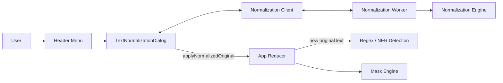
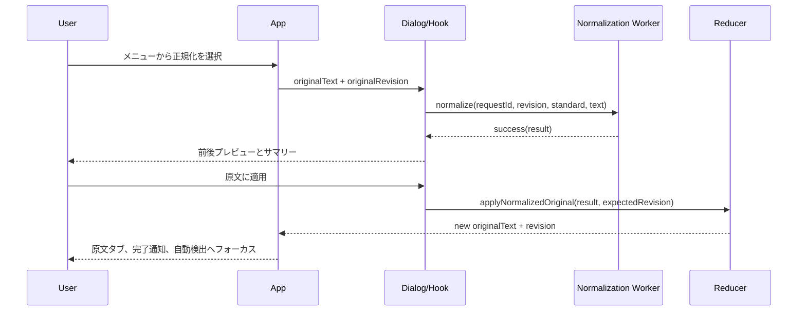
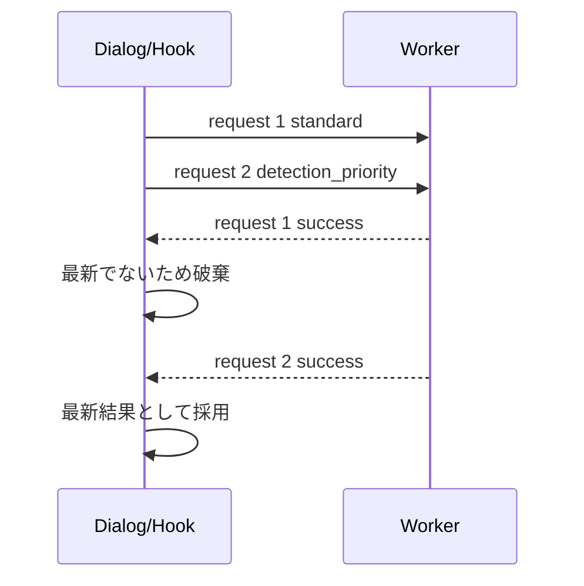

# マスキング前テキスト正規化 詳細設計

## 1. 文書情報

| 項目 | 内容 |
| --- | --- |
| 対象 | Local PII Masker |
| 文書種別 | 追加機能詳細設計書 |
| ステータス | 実装前設計確定 |
| 作成日 | 2026-07-21 |
| 対応要件 | [マスキング前テキスト正規化 追加機能要件](text-normalization-requirements.md) |
| 関連文書 | [MVP要件定義](requirements.md)、[画面設計仕様](ui-design.md)、[アーキテクチャ方針](architecture.md)、[Phase 6 OCR崩れ対応](ocr-normalization.md) |

## 2. 設計目的

本設計は、ユーザーが貼り付けた原文をマスク対象検出前に任意で正規化し、正規化前後を確認してから正規化結果を新しい原文へ適用する機能を、既存の原文正本・ブラウザ内処理・非永続化の原則を維持して実装するための構成を定義する。

設計上の重点は次のとおりとする。

1. 検出済み候補と正規化後原文の不整合を発生させない。
2. 正規化前後のユーザーテキストをセッション外へ出さない。
3. ルールをReactコンポーネントから分離し、決定的な純粋関数として検証する。
4. 正規化前後の差分を、全文比較用の高コストな汎用差分アルゴリズムに依存せず生成する。
5. 現在の「原文」「マスク結果」タブを増やさず、通常画面の複雑さを増やさない。
6. 既存の検出専用OCR正規化と、原文を書き換える本機能を混同しない。

## 3. 設計決定

| ID | 決定 |
| --- | --- |
| TND-001 | 正規化画面はヘッダーメニューから開く大型モーダル`DLG-N01`とし、URLルートと第3タブを追加しない |
| TND-002 | 正規化ドラフトはReactの一時状態と専用Worker内だけに保持し、セッションReducerへ保存しない |
| TND-003 | 正規化計算は専用Web Workerで実行し、UIスレッドとNER Workerから分離する |
| TND-004 | 正規化結果はUTF-16コード単位の原文位置対応を保持し、適用ルールからプレビュー差分を生成する |
| TND-005 | 汎用diff依存を追加せず、ルール実行時の編集イベントと位置対応から変更箇所を構築する |
| TND-006 | 正規化ロックは候補件数から導出せず、Reducerの`normalizationLockReason`で明示管理する |
| TND-007 | 正常完了した自動検出は候補0件でもロックし、候補削除・無効化・原文編集では解除しない |
| TND-008 | 適用時は原文リビジョンを照合し、古いプレビューをReducerが受け付けない |
| TND-009 | 初期モードは`standard`とし、`detection_priority`はユーザーが明示選択する |
| TND-010 | 変換ルール、文字変換表、構造判定、メッセージ対応は一か所に集約する |
| TND-011 | 既存の検出専用正規化は挙動を維持し、共通化は文字分類・位置対応等の低水準純粋関数に限定する |
| TND-012 | 正規化適用は自動検出を開始せず、適用後に既存の「自動検出」へフォーカスを移す |

## 4. 全体構成



### 4.1 責務分割

| 層 | 責務 |
| --- | --- |
| UI | 起動、モード選択、計算状態、前後プレビュー、変更サマリー、適用・キャンセル、フォーカス管理 |
| Client/Hook | Worker生成・破棄、要求ID、最新要求だけの採用、再試行、一般化エラーへの変換 |
| Worker | 正規化エンジン実行、成功・失敗応答、ユーザーテキストを含まないエラー生成 |
| Domain | 文字分類、構造境界、正規化ルール、位置対応、変更イベント、集計、プレビューセグメント生成 |
| Reducer | 原文リビジョン、正規化ロック、検出結果との原子的な状態遷移、正規化結果の適用 |
| Selector | 正規化操作の可否と無効理由の算出 |

## 5. ディレクトリ設計

```text
src/
├─ app/
│  ├─ reducer.ts
│  ├─ reducer.test.ts
│  ├─ normalizationAvailability.ts
│  └─ normalizationAvailability.test.ts
├─ components/
│  ├─ TextNormalizationDialog.tsx
│  ├─ TextNormalizationDialog.test.tsx
│  ├─ NormalizationPreview.tsx
│  └─ NormalizationChangeSummary.tsx
├─ hooks/
│  ├─ useTextNormalization.ts
│  └─ useTextNormalization.test.ts
└─ domain/
   └─ normalization/
      ├─ shared/
      │  ├─ mappedText.ts
      │  ├─ characterClasses.ts
      │  └─ characterMaps.ts
      ├─ detection/
      │  └─ ...既存の検出専用正規化
      └─ document/
         ├─ types.ts
         ├─ ruleCatalog.ts
         ├─ protectedRanges.ts
         ├─ structuredValidators.ts
         ├─ normalizeDocumentText.ts
         ├─ buildPreviewSegments.ts
         ├─ normalizationWorker.ts
         ├─ normalizationClient.ts
         ├─ rules/
         │  ├─ baseRules.ts
         │  ├─ structuredPiiRules.ts
         │  ├─ labelAndListRules.ts
         │  └─ detectionPriorityRules.ts
         └─ *.test.ts
```

`shared/`へ移す既存処理は、UTF-16位置対応、文字種判定、全角ASCII変換表等の低水準関数だけとする。既存の`normalizeForDetection`のルール順序、候補範囲、イベント内容を変更する共通化は本機能と同時に行わない。

## 6. ドメイン型

```ts
export type DocumentNormalizationMode =
  | "standard"
  | "detection_priority";

export type DocumentNormalizationRuleId =
  | "unicode_nfc"
  | "line_ending"
  | "invisible_character"
  | "fullwidth_ascii"
  | "structured_hyphen"
  | "email_spacing"
  | "email_line_break"
  | "phone_spacing"
  | "phone_line_break"
  | "postal_code_spacing"
  | "postal_code_line_break"
  | "date_time_spacing"
  | "date_time_line_break"
  | "label_value_line_break"
  | "list_item_wrap"
  | "excess_whitespace"
  | "person_inter_character_space"
  | "person_line_break"
  | "kana_inter_character_space"
  | "address_line_break"
  | "organization_line_break"
  | "identifier_spacing"
  | "identifier_line_break"
  | "japanese_line_wrap"
  | "prose_line_wrap";

export type NormalizationChangeKind =
  | "character"
  | "space"
  | "line_break"
  | "join";

export type TextRange = {
  start: number;
  end: number;
};

export type SourceMapping = {
  originalStart: number;
  originalEnd: number;
  changed: boolean;
  ruleIds: DocumentNormalizationRuleId[];
};

export type DocumentNormalizationEvent = {
  ruleId: DocumentNormalizationRuleId;
  kind: NormalizationChangeKind;
  originalRange: TextRange;
};

export type NormalizationRuleSummary = {
  ruleId: DocumentNormalizationRuleId;
  kind: NormalizationChangeKind;
  count: number;
};

export type DocumentNormalizationResult = {
  normalizedText: string;
  mappings: SourceMapping[];
  events: DocumentNormalizationEvent[];
  summary: NormalizationRuleSummary[];
  changedLocationCount: number;
};
```

オフセットは、CodeMirror、正規表現、既存の検出正規化と合わせてUTF-16コード単位の半開区間`[start, end)`とする。サロゲートペアを構成するコード単位を別々のルール対象として変更してはならない。

### 6.1 変更件数

- 1件は、同じルールによって一度に変更される連続範囲とする。
- 同じルールの隣接・重複イベントは1件へ統合する。
- 異なるルールが同じ範囲へ適用された場合は、ルール別件数では各1件として数える。
- 総変更箇所数は、全ルールの原文範囲を統合した非重複範囲数とする。
- 削除文字数や置換文字数を変更件数として表示しない。

## 7. 位置対応と差分設計

### 7.1 MappedText

正規化エンジンは、文字列と原文位置対応を一体として処理する。

```ts
type MappedCodeUnit = {
  value: string;
  originalStart: number;
  originalEnd: number;
  changed: boolean;
  ruleIds: DocumentNormalizationRuleId[];
};

type MappedText = MappedCodeUnit[];
```

初期状態では各UTF-16コード単位を同じ原文範囲へ対応させる。置換時は元の範囲を引き継ぎ、結合時は結合対象全体の原文範囲を引き継ぐ。削除時は出力マッピングを生成せず、削除範囲をイベントへ残す。

### 7.2 プレビューセグメント

```ts
type PreviewSegment = {
  text: string;
  changed: boolean;
  ruleIds: DocumentNormalizationRuleId[];
};

type NormalizationPreview = {
  before: PreviewSegment[];
  after: PreviewSegment[];
};
```

- `before`はイベントの`originalRange`を統合して生成する。
- `after`は最終`mappings`の`changed`と`ruleIds`から生成する。
- 同じ状態とルール集合が連続するセグメントは結合する。
- 削除だけの変更は`before`側だけで強調し、変更サマリーで削除を通知する。
- UIはReactのテキストノードと`mark`要素で描画し、HTML文字列を生成しない。

汎用の最長共通部分列や行単位diffは使用しない。これにより10,000文字での二乗時間・大容量メモリ消費を避ける。

## 8. ルール実行基盤

```ts
type NormalizationRule = {
  id: DocumentNormalizationRuleId;
  modes: readonly DocumentNormalizationMode[];
  kind: NormalizationChangeKind;
  apply(input: MappedText, context: RuleContext): MappedText;
};

type RuleContext = {
  protectedRanges: readonly TextRange[];
  structure: DocumentStructure;
};
```

ルール一覧と順序は`ruleCatalog.ts`の不変配列を正本とし、UIから個別ルールを直接呼び出さない。各ルールは入力を変更せず、新しい`MappedText`を返す純粋関数とする。

### 8.1 ルール順序

| 順序 | ルール群 |
| ---: | --- |
| 1 | `unicode_nfc` |
| 2 | `line_ending` |
| 3 | `invisible_character` |
| 4 | `fullwidth_ascii` |
| 5 | 構造化PIIのハイフン・空白・改行 |
| 6 | 氏名・フリガナ・住所・組織・識別番号 |
| 7 | ラベルと値 |
| 8 | 箇条書き折り返し |
| 9 | 日本語文字列・通常文章の折り返し |
| 10 | `excess_whitespace` |
| 11 | イベント統合、サマリー、プレビュー用位置対応の確定 |

後段ルールは、前段で確定した保護範囲を破壊しない。構造解析に影響するMarkdownフェンス、表、リスト境界は、改行コード統一後かつ一般的な文字変換前に識別する。

## 9. 文字変換表

### 9.1 全角ASCII

- Unicode範囲`U+FF01`から`U+FF5E`は、対応する`U+0021`から`U+007E`へ変換する。
- 全角空白`U+3000`は、コード・Markdown構造を除く通常テキストで`U+0020`へ変換する。
- 変換対象には全角数字、全角英字、ハイフン、スラッシュ、コロン、ピリオド、カンマ、括弧、アットマーク、プラス、シャープを含む。
- カタカナ、ひらがな、漢字、半角カナは変換しない。
- NFKCを全文へ一括適用しない。

### 9.2 ハイフン類

次の文字は、構造化PIIまたは識別番号として妥当な範囲内にある場合だけASCIIハイフン`-`へ変換する。

| 文字 | Unicode |
| --- | --- |
| `‐` | U+2010 |
| `‑` | U+2011 |
| `‒` | U+2012 |
| `–` | U+2013 |
| `—` | U+2014 |
| `―` | U+2015 |
| `−` | U+2212 |
| `﹣` | U+FE63 |
| `－` | U+FF0D |

長音記号`ー`（U+30FC）は変換対象外とする。一般文章中のダッシュも、構造化PIIまたは識別番号の妥当性検証を通らない限り保持する。

### 9.3 不可視文字・制御文字

| 処理 | 対象 |
| --- | --- |
| 除去 | U+200B ZERO WIDTH SPACE、U+2060 WORD JOINER、先頭または途中のU+FEFF |
| ASCII空白へ変換 | U+00A0、U+2007、U+202F、通常テキスト中のU+3000 |
| 除去 | C0/C1制御文字。ただしLFとTABを除く |
| 保持 | U+200C、U+200D、Variation Selector、絵文字を構成する結合文字 |

TABは表・インデント構造を壊さないため全体では保持し、妥当性検証済みの構造化PII内部に限って除去できる。

## 10. 文書構造の保護

`protectedRanges.ts`は改行統一後のテキストを1回走査し、次を識別する。

- 空行
- Markdownコードフェンス（```` ``` ````または`~~~`）とその内部
- 4空白以上で始まるインデントコード
- ATX見出し
- Markdown水平区切り
- Markdown表の区切り行とセル境界
- 箇条書き・連番項目の開始行
- 明確な文末記号

### 10.1 保護方針

- コードフェンス内とインデントコード内は、改行コード統一とNFC以外の変換を行わない。
- Markdown表はセル単位で処理し、`|`を越えて結合しない。
- 見出し本文内の文字変換は許可するが、前後行と結合しない。
- 水平区切り自体を変換せず、前後行を結合しない。
- 箇条書きは同じ項目の継続行だけを結合し、次の項目と結合しない。
- 空行は両モードとも越えない。

## 11. 標準モードのルール

### 11.1 構造化PIIの検証方式

空白・改行・ハイフンを除去または統一する前に候補窓を抽出し、仮変換後の文字列が対象形式へ完全一致する場合だけ編集を確定する。

| 対象 | 最大候補長 | 最大行数 | 妥当性 |
| --- | ---: | ---: | --- |
| メールアドレス | 254 | 3 | ローカル部、単一`@`、妥当なドメインラベルとTLD |
| 電話番号 | 32 | 3 | 既存の国内電話番号形式と桁数 |
| 郵便番号 | 16 | 2 | `3桁-4桁`または既存許容形式 |
| 日付 | 32 | 2 | 西暦・和暦の構造と実在日 |
| 時刻 | 16 | 2 | 0～23時、0～59分、任意の秒 |

検証関数は正規化エンジンと検出器から利用できる純粋関数として切り出し、`runRegexDetection`全体を正規化エンジンから呼ばない。これにより検出用正規化との循環依存を避ける。

### 11.2 ラベルと値

初期ラベル辞書は次を含む。

```text
氏名 名前 住所 所在地 郵便番号 電話番号 携帯番号 FAX
メールアドレス 生年月日 勤務先 会社名 口座番号 会員番号 顧客番号
```

- ラベル末尾が`:`または`：`の場合、次行の値と区切りなしで結合する。
- ラベル末尾に区切りがない場合、次行との間をASCII空白1文字に置換する。
- 次行が空行、見出し、別ラベル、別箇条書き、表、コードの場合は結合しない。
- 値行は1行だけを基本とし、住所等の対象固有ルールが妥当と判断した場合だけ追加行を含める。

### 11.3 箇条書き

項目開始記号は、`・ ● ○ ■ □ ※ - *`、数字連番、括弧数字、丸数字、カナ連番、`第N`を対象とする。

- 次行が新しい項目開始、空行、見出し、表、コードでなければ同一項目の継続行とする。
- 日本語文字同士は区切りなしで結合する。
- ASCII英数字の単語同士はASCII空白1文字で結合する。
- 読点・句読点の直前へ空白を挿入しない。

## 12. 検出優先モードのルール

### 12.1 氏名・フリガナ

- `氏名`、`名前`、`担当者`等のラベル値では、漢字・ひらがな・カタカナ間の単一空白、全角空白、単一改行を除去する。
- 一般姓辞書で始まる2～6文字の漢字姓名では、各文字間の0～1空白を除去する。
- カタカナまたはひらがなだけで構成する2～16文字のフリガナ値では文字間空白を除去する。
- タブ、空行、句読点、別項目境界を越えない。
- 姓名候補が最大長を超える場合は変更しない。

### 12.2 住所

- 既存の都道府県、市区町村、町域、丁目、番、号の参照パターンを利用する。
- 最大3行、正規化後256文字以内の窓だけを評価する。
- 仮結合後に完全な住所構造を構成できる場合だけ改行を除去する。
- 建物名・階・部屋番号は、住所本体に連続し、別ラベルや別項目を越えない場合だけ含める。
- 空行、表セル、見出し、コード、水平区切りを越えない。

### 12.3 組織名・部署名

- `株式会社`、`有限会社`、`合同会社`等の会社種別、または`会社`、`法人`、`センター`、`ソリューションズ`等の組織指標を必須とする。
- 最大3行、正規化後128文字以内の窓だけを評価する。
- `部`、`課`、`室`、`グループ`等の部署名は、組織名直後または明示ラベル値の場合だけ結合対象に含める。
- `です`、`など`等の一般文脈語を結合対象に含めない。
- 指標のない一般文章を組織名として結合しない。

### 12.4 識別番号

- `口座番号`、`会員番号`、`顧客番号`、`契約番号`、`証明書番号`等の明示ラベルを必須とする。
- 値はASCII英数字、ハイフン、スラッシュからなる正規化後128文字以内とする。
- 値内部の空白、全角空白、TAB、単一改行を除去する。
- 空行または次のラベルを越えない。

### 12.5 日本語文字間空白

コード・表構造を除く通常テキストで、漢字、ひらがな、カタカナ、数字の間にある空白1文字を除去する。2文字以上の連続空白とTABは一般ルールでは除去しない。氏名、住所、組織名、ラベル値の個別ルールが先に適用された範囲は再処理しない。

### 12.6 通常文章の折り返し

隣接する2行がすべて次を満たす場合、改行を折り返しとして除去する。

1. 間に空行がない。
2. 前行が`。！？.!?`で終わらない。
3. 次行が見出し、別箇条書き、ラベル、表、コード、水平区切りではない。
4. 前行末と次行頭が文書構造記号ではない。
5. 結合後の段落がアプリの入力上限を超えない。

日本語文字同士は区切りなし、ASCII単語同士は空白1文字で結合する。読点`、`、カンマ、閉じ括弧等の前へ空白を挿入しない。

## 13. 正規化Worker

### 13.1 メッセージ型

```ts
type NormalizationWorkerRequest = {
  type: "normalize";
  requestId: number;
  sourceRevision: number;
  mode: DocumentNormalizationMode;
  text: string;
};

type NormalizationWorkerResponse =
  | {
      type: "success";
      requestId: number;
      sourceRevision: number;
      mode: DocumentNormalizationMode;
      result: DocumentNormalizationResult;
    }
  | {
      type: "error";
      requestId: number;
      sourceRevision: number;
      code: "NORMALIZATION_FAILED";
    };
```

エラー応答に入力文字列、変更イベント、例外メッセージ、スタックトレースを含めない。

### 13.2 ライフサイクル

1. `DLG-N01`を開くときにWorkerを生成する。
2. 初期モード`standard`の要求を送る。
3. モード変更ごとに`requestId`を増やして新しい要求を送る。
4. 最新`requestId`と一致する応答だけを採用する。
5. 古い応答はUIへ反映せず破棄する。
6. キャンセル、適用、画面破棄でWorkerを`terminate()`し、イベントハンドラーを解除する。
7. Workerエラー時はWorkerを破棄し、「再試行」で新しいWorkerを生成する。

WorkerはNER Workerと共有しない。正規化処理はモデル資材を必要とせず、ネットワークAPIを呼び出さない。

## 14. Reducer設計

### 14.1 追加状態

```ts
export type NormalizationLockReason =
  | "detection_completed"
  | "candidate_registered";

export type AppState = MaskSession & {
  // existing UI state...
  originalRevision: number;
  normalizationLockReason?: NormalizationLockReason;
};
```

- `originalRevision`はNFC正規化後の`originalText`が実際に変化した場合だけ増加する。
- 正規化画面の開閉、モード、計算結果は`AppState`へ保存しない。
- `normalizationLockReason`は候補削除、無効化、原文編集で解除しない。
- `clearSession`だけが`originalRevision: 0`、`normalizationLockReason: undefined`へ戻す。

### 14.2 追加・変更アクション

```ts
type AppAction =
  | {
      type: "applyNormalizedOriginal";
      value: string;
      expectedRevision: number;
    }
  | {
      type: "completeDetection";
      candidates: DetectionCandidate[];
      createId: () => string;
      outcome: "success" | "failed" | "cancelled";
    }
  | ExistingActions;
```

### 14.3 `applyNormalizedOriginal`

Reducerは次をすべて満たす場合だけ適用する。

- `expectedRevision === state.originalRevision`
- `normalizationLockReason === undefined`
- `entries.length === 0`
- NFC正規化後の適用値が現在の原文と異なる

適用時は次を一つのReducer遷移で行う。

- `originalText`を正規化結果へ置換
- `originalRevision`を1増加
- `activeTextView`を`original`へ変更
- `selectedEntryId`を解除
- `entryFilter`を`all`へ戻す
- `entrySearch`を空にする
- 完了通知を設定

`externalResponse`と`restoreExpanded`は本機能と独立した入力であるため変更しない。候補は適用条件上0件だが、防御的に新規候補やトークンを生成しない。

条件不一致の場合は状態を変更しない。UIは適用直前にも同じ条件を確認し、リビジョン不一致時は再計算を案内する。

### 14.4 `completeDetection`

現在の`mergeDetectedCandidates`を、候補統合と正規化ロックを原子的に行う`completeDetection`へ置き換える。

| outcome | candidates | ロック |
| --- | ---: | --- |
| `success` | 0件以上 | `detection_completed` |
| `failed` | 1件以上 | `candidate_registered` |
| `cancelled` | 1件以上 | `candidate_registered` |
| `failed` | 0件 | 変更なし |
| `cancelled` | 0件 | 変更なし |

原文変更、全消去、アンマウントにより結果自体を破棄した場合は`completeDetection`をdispatchしない。

### 14.5 手動追加

`addManualEntry`は、新規追加・既存項目の手動昇格のどちらでも`normalizationLockReason: "candidate_registered"`を設定する。追加後に項目を削除してもロックを保持する。

## 15. 正規化操作可否

```ts
type NormalizationAvailability =
  | { state: "enabled" }
  | {
      state: "disabled";
      reason:
        | "empty_source"
        | "detecting"
        | "normalizing"
        | "locked";
    };
```

`getNormalizationAvailability`を純粋関数とし、`App.tsx`の条件式へ分散させない。

優先順位は次とする。

1. 原文が空または空白だけなら`empty_source`
2. 正規化ロック済みなら`locked`
3. 自動検出中なら`detecting`
4. 正規化画面表示中または計算中なら`normalizing`
5. その他は`enabled`

メニュー項目は`aria-disabled`を使用して無効理由を読み上げ可能にする。無効項目の選択イベントではダイアログを開かない。

## 16. UI詳細設計

### 16.1 ヘッダーメニュー

```text
メニュー
├─ テキストを正規化
────────────
└─ すべて消去
```

- メニューを開いたときは「テキストを正規化」へ初期フォーカスを置く。
- `ArrowDown`、`ArrowUp`、`Home`、`End`で項目間を移動する。
- `Enter`または`Space`で有効項目を実行する。
- `Escape`で閉じてメニューボタンへ戻す。
- 正規化が無効でも項目をメニューから消さず、`aria-describedby`で理由へ関連付ける。
- 区切りは`role="separator"`とする。
- 「すべて消去」だけを危険色とし、正規化項目のホバー・フォーカスに危険色を使用しない。

### 16.2 DLG-N01レイアウト

```text
┌──────────────────────────────────────────────────────────────┐
│ テキスト正規化                                      [閉じる] │
├──────────────────────────────────────────────────────────────┤
│ 注意文                                                       │
│ ┌ 正規化モード ─────────────┐ ┌ 変更サマリー ────────────┐ │
│ │ (●) 標準  ( ) 検出優先    │ │ 変更箇所、内訳            │ │
│ └──────────────────────────┘ └────────────────────────┘ │
│ ┌ 正規化前 ────────────┐  ┌ 正規化後 ───────────┐ │
│ │ 読み取り専用プレビュー │  │ 変更箇所を強調       │ │
│ └──────────────────────┘  └─────────────────────┘ │
├──────────────────────────────────────────────────────────────┤
│                              [キャンセル] [適用]            │
└──────────────────────────────────────────────────────────────┘
```

### 16.3 寸法とレスポンシブ

- 幅：`min(1200px, calc(100vw - 48px))`
- 高さ：`min(820px, calc(100dvh - 48px))`
- 本文領域だけをスクロール可能とし、ヘッダーとフッターを固定する。
- モーダルヘッダーは52px、フッターは44pxを基準とし、通常画面のヘッダー・フッターに近い高さに抑える。
- 警告、モード選択、変更サマリーは上下余白を抑えたコンパクトな情報帯とし、前後プレビューへ表示領域を優先配分する。
- 1024px以上では正規化モードと変更サマリーを横並びにし、モード内の2選択肢も横並びにする。1024px未満ではこれらを上下配置に戻す。
- 正規化モードと変更サマリーの2列は、前後プレビューの2列と同じ幅・間隔にする。
- モード説明文は画面内には表示せず、各モード選択肢のホバー時に`title`属性で全文を確認できるようにする。変更内訳は1行の省略表示とし、ホバー時に全文を確認できるようにする。
- 前後プレビューの表示領域はデスクトップで`clamp(360px, 56vh, 560px)`を目安とし、本文の文字サイズは15pxとする。
- 1024px以上は前後2列とする。
- 1024px未満は前後を上下に配置する。
- 各プレビューは`white-space: pre-wrap`とし、独立したスクロール領域を持つ。
- 変更箇所は`mark`、左境界、ラベルまたはサマリーを組み合わせ、色だけに依存しない。
- フッターのキャンセル操作は補助的な小型ボタンとし、適用操作の表示ラベルは「適用」とする。適用ボタンのホバー説明には「正規化後の内容を原文に適用します。」を表示する。

### 16.4 ダイアログ状態

| 状態 | 表示 | 適用 |
| --- | --- | --- |
| `computing` | スピナー、選択中モード、計算中通知 | 無効 |
| `ready_changed` | 前後、変更サマリー | 有効 |
| `ready_unchanged` | 前後、変更なし通知 | 無効 |
| `error` | 一般化エラー、再試行、キャンセル | 無効 |
| `stale` | 原文変更通知、再計算 | 無効 |

計算中は直前モードのプレビューを確定結果として見せない。表示を残す場合は`aria-hidden`かつ視覚的に無効とし、計算完了後に差し替える。

### 16.5 フォーカス

- 起動時のフォーカスはダイアログ見出し（`tabIndex={-1}`）へ置く。
- `Tab`と`Shift+Tab`をダイアログ内へ閉じ込める。
- `Escape`、閉じる、キャンセルではメニューの正規化項目へ戻す。
- 適用成功時はダイアログを閉じ、原文タブを表示して既存の「自動検出」ボタンへ移す。
- 適用ボタンを初期フォーカスにしない。
- 背景クリックでは閉じない。

## 17. シーケンス設計

### 17.1 プレビューと適用



### 17.2 モード競合



## 18. エラー設計

| コード | 発生箇所 | UI | 状態 |
| --- | --- | --- | --- |
| `NORMALIZATION_FAILED` | ドメイン処理 | 再試行・キャンセル | 原文保持 |
| `NORMALIZATION_WORKER_FAILED` | Worker通信 | Worker再生成後に再試行 | 原文保持 |
| `NORMALIZATION_STALE` | 適用前リビジョン照合 | 再計算 | 原文保持 |
| `NORMALIZATION_LOCKED` | 適用前ロック照合 | 無効理由を表示 | 原文保持 |

例外、Workerエラーイベント、ユーザー向けメッセージへ原文、正規化結果、変更断片を含めない。開発用Consoleにも同データを出力しない。

## 19. 性能設計

### 19.1 処理量

- 現行UI上限の10,000 UTF-16コード単位を初期評価上限とする。
- 構造走査と一般ルールは原則`O(n)`とする。
- 構造化候補は最大長・最大行数を制限し、全文に対する無制限の後方探索を行わない。
- 正規表現は壊滅的バックトラッキングを避け、候補窓を切り出してから完全一致検証する。
- 全文LCS等の`O(n²)`差分を使用しない。

### 19.2 性能予算

Windows 11、Chrome最新版およびEdge最新版のウォーム状態で、合成10,000文字に対するWorker内処理の暫定予算を次とする。

| 処理 | p95目標 | 上限 |
| --- | ---: | ---: |
| 標準モード | 250ms以下 | 1,000ms未満 |
| 検出優先モード | 500ms以下 | 1,000ms未満 |
| プレビューセグメント生成 | 100ms以下 | 250ms未満 |
| Reducer適用 | 50ms以下 | 100ms未満 |

1秒以上継続する場合は計算中表示を維持する。予算を超える実装はリリース前にプロファイルし、ルール単位の処理時間をユーザーテキストなしで計測する。

## 20. プライバシー設計

| データ | React一時状態 | Workerメモリ | Reducer | Storage | Network/Log |
| --- | --- | --- | --- | --- | --- |
| 正規化前テキスト | ダイアログ中のみ | 要求処理中のみ | 既存`originalText` | 不可 | 不可 |
| 正規化後テキスト | ダイアログ中のみ | 応答まで | 適用後だけ`originalText` | 不可 | 不可 |
| 位置対応・イベント | ダイアログ中のみ | 応答まで | 不可 | 不可 | 不可 |
| 変更件数 | ダイアログ中のみ | 応答まで | 不可 | 不可 | 個数のみ可 |
| ルールID・経過時間 | 任意 | 任意 | 不可 | 不可 | ユーザー文字を伴わない診断だけ可 |

Worker終了時は参照とイベントハンドラーを解放する。正規化用Worker、ルール、辞書はアプリの静的資材として取得できるが、ユーザーテキストと公開資材を同じキャッシュデータとして扱わない。

## 21. テスト設計

### 21.1 観点

ケース作成前に、次の観点で対象を分解する。

- 機能観点：ルール、モード、順序、差分、適用、キャンセル、ロック
- 非機能観点：10,000文字、Worker競合、メモリ解放、ブラウザ差、ReDoS耐性
- データ観点：構造化PII、日本語、Markdown、制御文字、サロゲートペア、改行コード
- UI観点：メニュー、大型ダイアログ、計算状態、変更表示、キーボード、読み上げ
- 正常系：標準・検出優先のプレビューと適用
- 異常系：Worker失敗、古い応答、リビジョン不一致、ロック競合
- 境界値：空、変更なし、1文字、最大文字数、最大候補長、空行、構造境界
- 状態遷移：未入力、入力、計算、適用、検出、候補0件、手動追加、全消去

### 21.2 単体テスト

| 対象 | 検証意図 |
| --- | --- |
| `characterMaps` | 変換表の全要素と長音・絵文字等の非対象を固定する |
| `protectedRanges` | コード、表、見出し、空行、リスト境界を越えないことを確認する |
| 各ルール | 肯定例・否定例・境界長・冪等性を確認する |
| `normalizeDocumentText` | ルール順序、決定性、モード差、位置対応を確認する |
| `buildPreviewSegments` | 削除・置換・重複イベントの前後強調を確認する |
| `normalizationAvailability` | 候補0件完了、削除後、失敗・中止の可否を確認する |
| `appReducer` | 適用の原子性、リビジョン拒否、ロック非解除、全消去を確認する |

既存の`normalizeForDetection`には抽出前後の特性テストを追加し、共通プリミティブ化でPhase 6候補範囲が変わらないことを先に保証する。

### 21.3 コンポーネント・統合テスト

- メニューの正規化項目、区切り、危険操作の順序
- 有効、空原文、検出中、ロック中の表示と無効理由
- 初期モード、モード切替、計算中、変更あり、変更なし、失敗
- キャンセル時の非変更
- 適用時の原文、原文タブ、通知、フォーカス
- Worker応答順序を逆転させた場合の古い結果破棄
- 候補0件の検出完了後のロック
- 手動追加後に項目を削除してもロックが残ること
- 全消去後のロック解除

### 21.4 E2E・プライバシーテスト

- ChromiumとEdgeでメニューから適用までをキーボードだけで完了する。
- 1024px以上の2列、1024px未満の上下配置を確認する。
- axeでWCAG 2 A / AA違反0件を確認する。
- 合成固有マーカーを正規化前後に含め、Network、LocalStorage、SessionStorage、IndexedDB、Cookie、Cache名、Consoleへ現れないことを確認する。
- 10,000文字を標準・検出優先で処理し、予算とUI応答性を記録する。
- 同一ブラウザ実体を使うE2Eスクリプトを並列実行しない。

### 21.5 失敗時の証跡

失敗時は次だけを記録し、ユーザーテキストを記録しない。

- テストID
- モード
- ルールID
- requestId
- sourceRevision
- Worker状態
- 経過時間
- 期待した変更件数と実際の変更件数

## 22. 要件トレーサビリティ

| 要件 | 主設計 | 主テスト |
| --- | --- | --- |
| FR-N01～N02 | 16.1、16.2 | コンポーネント |
| FR-N03～N06 | 8～12 | ルール単体・エンジン統合 |
| FR-N07 | 7、16.3、16.4 | プレビュー単体・コンポーネント |
| FR-N08 | 14.3、17.1 | Reducer・統合 |
| FR-N09 | 13.2、16.5 | コンポーネント・E2E |
| FR-N10 | 14.4、14.5、15 | Selector・Reducer・統合 |
| FR-N11 | 13、18 | Worker・異常系統合 |
| プライバシー | 20 | 固有マーカーE2E |
| 性能 | 19 | ベンチマーク・E2E |

## 23. 実装順序

1. 既存検出専用正規化の特性テストを追加する。
2. 低水準の文字分類・位置対応・変換表を`shared/`へ抽出する。
3. `document/`の型、構造保護、標準ルール、検出優先ルールを純粋関数で実装する。
4. 位置対応、イベント集計、プレビューセグメント、冪等性テストを実装する。
5. 正規化WorkerとClient/Hookを実装する。
6. Reducerへリビジョン、ロック、検出完了、適用アクションを追加する。
7. メニューと`DLG-N01`を実装する。
8. コンポーネント、統合、E2E、プライバシー、性能テストを追加する。
9. UI文言と実装結果を文書へ反映する。

各段階で既存のマスキング、復元、Phase 6 OCR検出を回帰確認し、検出専用正規化の出力が意図せず変わった場合は共通化を戻して原因を切り分ける。

## 24. 実装開始条件

次を満たした時点で実装へ進める。

1. 本設計のモード、変換表、ロック状態、Worker分離が承認されている。
2. 標準・検出優先の肯定例と否定例を合成フィクスチャとして準備できる。
3. 既存Phase 6正規化の回帰テストを先に実行できる。
4. 10,000文字のベンチマーク方法と対象ブラウザを固定できる。
5. プライバシー検査用の合成固有マーカーを準備できる。
