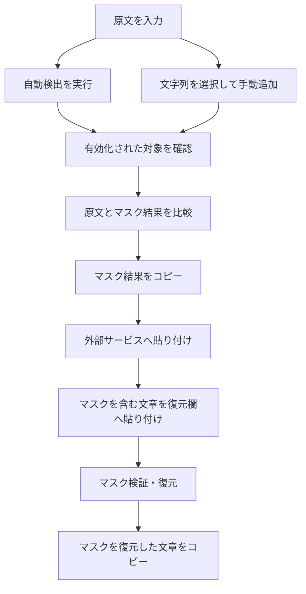
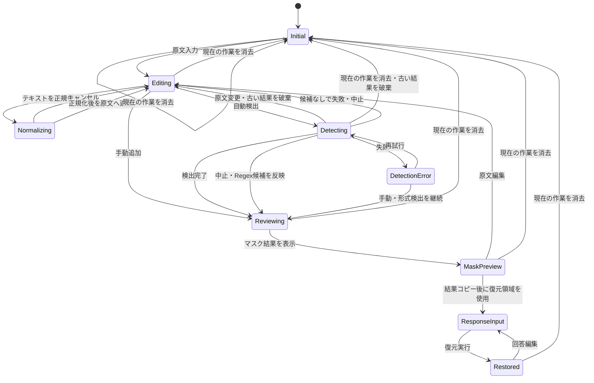

# Local PII Masker MVP 画面設計仕様書

## 1. 文書情報

| 項目 | 内容 |
| --- | --- |
| 対象 | Local PII Masker MVP |
| 文書種別 | 画面設計仕様書 |
| ステータス | 初版 |
| 対象端末 | PC |
| 対象ブラウザ | Google Chrome最新版、Microsoft Edge最新版 |
| 関連文書 | [MVP要件定義](requirements.md)、[アーキテクチャ方針](architecture.md) |

## 2. 目的

本書は、MVP要件をPC向けWeb画面へ落とし込むため、画面構成、表示項目、操作、状態変化、メッセージ、アクセシビリティおよび画面単位の受入条件を定義する。

MVPは複数ページへ分割せず、原文入力からマスク復元までを1ページのワークスペースで完結させる。

## 3. 画面設計方針

1. **確認してから外部へ渡す**  
   自動検出結果をそのまま確定せず、ユーザーが候補を確認できる構成とする。

2. **原文とマスク結果を混同させない**  
   原文は編集可能、マスク結果は読み取り専用とし、表示状態をタブと見出しで明示する。

3. **原文を誤ってコピーしにくくする**  
   主要なコピー操作はマスク結果側にのみ配置する。原文入力欄の標準的な選択・コピーは妨げないが、アプリ独自のコピー按钮は設けない。

4. **同一文字列の一括適用を明示する**  
   手動追加時および候補一覧で、対象文字列の出現数を表示する。文脈付きモードで自動除外が発生した場合は、マスク数と検出総数を分けて表示する。

5. **AIが利用できなくても操作を継続できる**  
   モデル取得やNER推論が失敗しても、原文入力、手動追加、正規表現検出、マスク生成、復元を利用可能とする。

6. **外部送信がないことと保存境界を常時認識できる**
   「ローカル処理・外部送信なし」をコンパクトなステータスで常時表示し、明示保存前のページ更新・終了時の扱いと、保存時の暗号化対象・平文メタデータは必要時に確認できる詳細表示へまとめる。

7. **自動検出は完全ではないことを明示する**  
   コピー前に、検出漏れがないかユーザー自身で確認する必要があることを表示する。

## 4. 画面一覧

MVPの通常画面は1画面とする。モーダル、ポップオーバーを補助画面として使用する。

| ID | 名称 | 種別 | 用途 |
| --- | --- | --- | --- |
| SCR-01 | マスキングワークスペース | メイン画面 | 原文入力、検出候補管理、マスク結果確認、マスク復元 |
| DLG-01 | 手動追加ダイアログ | モーダル | 選択文字列をマスク対象へ追加 |
| DLG-02 | 現在の作業を消去確認ダイアログ | モーダル | 現在のインメモリ作業を消去する前に確認 |
| DLG-03 | マスク対象0件コピー確認 | モーダル | 原文と同一のマスク結果をコピーする際の確認 |
| DLG-04 | 同一人物関連付けダイアログ | モーダル | 複数の`PERSON`項目を同じマスクトークンへ関連付ける |
| DLG-05 | 関連付け解除方法ダイアログ | モーダル | 3件以上の関連付けを個別または全体で解除する |
| DLG-N01 | テキスト正規化 | 大型モーダル | 正規化モード、正規化前後、変更サマリーを確認して原文へ適用 |
| POP-01 | 手動追加起動ポップオーバー | ポップオーバー | 原文上で選択した文字列を手動追加へ進める |
| TST-01 | トースト通知 | 一時通知 | コピー成功、候補追加、エラー等の結果通知 |

すべてのダイアログのフッターに配置するキャンセル、確定、適用ボタンは、メイン画面のコンパクト操作ボタンと同じ32px高とする。

ルーティングによる画面遷移は行わない。

## 5. 基本利用フロー



## 6. メイン画面全体構成

### 6.1 PC標準レイアウト

```text
┌────────────────────────────────────────────────────────────────────────────┐
│ Local PII Masker     [ローカル処理・外部送信なし]                    [☰] │
├───────────────────────────────────────────────┬────────────────────────────┤
│ テキストワークスペース                        │ マスク対象 [有効][無効][検索] │
│                                               │                            │
│ [原文] [マスク結果]                           │                            │
│ ┌───────────────────────────────────────────┐ │                            │
│ │                                           │ │                            │
│ │ 原文エディター／マスク結果プレビュー      │ │ □ 山田太郎                 │
│ │                                           │ │   人名・3か所・AI検出      │
│ │                                           │ │   [⋮ 操作メニュー]         │
│ └───────────────────────────────────────────┘ │                            │
│ 文字数: 1,240 / 30,000                       │ ☑ 090-1234-5678            │
│                                               │   電話番号・1か所・Regex   │
│ [自動検出]  状態: モデル未読込                │                            │
│                                               │                            │
│                  対象3件・置換7か所 [コピー] │                            │
├───────────────────────────────────────────────┴────────────────────────────┤
│ ▾ マスクを復元                                                        │
│ ┌──────────────────────────────┬───────────────────────────────────────┐ │
│ │ マスクを含む文章             │ マスクを復元した文章                  │ │
│ │                              │                                       │ │
│ │ [貼り付け欄]                 │ [読み取り専用]                        │ │
│ └──────────────────────────────┴───────────────────────────────────────┘ │
│ [復元する] 既知: 3 / 未出現: 1 / 不明: 0              [復元した文章をコピー] │
└────────────────────────────────────────────────────────────────────────────┘
```

### 6.2 レイアウト比率

- ページ本体の最大幅は固定せず、PC画面幅を活用する。
- メイン領域は左側のテキストワークスペースを優先し、概ね65%、右側の管理パネルを35%とする。
- 右パネルの推奨幅は360～440pxとする。
- メイン領域の最小高は、標準的な768px高の画面でテキストを十分確認できる値とする。
- マスク復元領域は折りたたみ可能とし、初期状態は閉じる。

## 7. SCR-01 マスキングワークスペース

### 7.1 ヘッダー

| ID | 項目 | 種別 | 仕様 |
| --- | --- | --- | --- |
| HD-01 | アプリ名 | テキスト | `Local PII Masker`を表示する |
| HD-02 | データ取扱表示 | ステータスバッジ | 「ローカル処理・外部送信なし」を表示し、フォーカスまたはホバーで詳細を示す |
| HD-04 | セッション操作メニュー | メニューボタン | 右上に縦三点アイコンで表示し、データがない場合は無効化する |
| HD-05 | 現在の作業を消去 | 危険操作メニュー項目 | セッション操作メニュー内に配置し、選択するとDLG-02を開く |
| HD-06 | テキストを正規化 | 通常操作メニュー項目 | HD-04内でHD-05より前に配置し、使用可能な場合はDLG-N01を開く。状態別の短い説明をホバーまたはキーボードフォーカスで表示する |

`HD-02`の詳細説明には、AIモデル等の公開資材をネットワークから取得する場合がある一方、原文や対応表は外部へ送信しないことを記載する。明示保存しない限り再読み込み・終了で作業内容が失われること、明示保存した場合は機密データを暗号化してOPFSへ保存することも示す。

現在の作業を消去する操作は利用頻度の低い破壊的操作であるため常時ボタン表示せず、セッション操作メニュー内に配置する。テキスト正規化もマスキング前だけに使う任意操作であるため、ワークスペースのタブや常時表示ボタンを増やさず同じメニューから起動する。正規化と現在の作業を消去する操作の間には区切りを置き、現在の作業を消去する操作だけを危険操作として表示する。正規化項目の説明と無効理由はメニュー内に常時表示せず、`role="tooltip"`と`aria-describedby`を用いてホバー、キーボードフォーカス、支援技術から確認可能にする。

### 7.2 データ取扱詳細

独立した常時表示バナーは設けず、ヘッダーのデータ取扱表示から必要時に確認できるようにする。

表示文言：

> 入力内容は保存されません。ページを再読み込みまたは閉じると、原文、マスク設定、マスクを含む文章、マスクを復元した文章は失われます。

- マウスのホバーとキーボードフォーカスの両方で表示する。
- 詳細を開くためだけの独立したボタンは追加しない。
- 作業領域の高さを常時消費しない。

## 8. テキストワークスペース

### 8.1 表示タブ

| タブ | 編集 | 目的 |
| --- | --- | --- |
| 原文 | 可 | 原文入力、編集、対象箇所確認、手動選択 |
| マスク結果 | 不可 | マスク後テキストの確認、コピー |

- 初期タブは「原文」とする。
- タブ切り替えで原文、候補、マスク設定を変更しない。
- 選択中のタブを色だけでなく下線、背景、`aria-selected`で示す。
- 原文が空の場合、「マスク結果」タブは選択できるが、空状態を表示する。

### 8.2 原文エディター

#### 8.2.1 初期状態

プレースホルダー：

> 個人情報をマスキングしたい日本語テキストを入力または貼り付けてください。

補助文：

> 入力内容はブラウザのメモリ内だけで処理され、保存されません。

#### 8.2.2 入力仕様

- 複数行テキストを入力・貼り付けできる。
- 原文は入力時にUnicode NFCへ正規化する。
- 文字数を常時表示する。
- 30,000文字を入力上限として文字数を表示する。
- 上限超過時も原文を勝手に切り捨てない。
- 入力値をHTMLとして解釈しない。
- 入力内容をURL、ブラウザ履歴、ログへ含めない。

#### 8.2.3 ハイライト

登録済みマスク対象の出現箇所を原文上でハイライトする。

- 有効な対象：青系の背景色で表示する
- 無効な対象：有効な対象より弱い灰系の背景色で表示する
- 管理パネルで選択中の対象：状態別の背景色を維持し、外枠を追加する
- 0件対象：原文上には表示しない
- 同じ位置で複数候補が重なる場合は、最長一致で実際に適用される範囲を優先表示する
- 色だけに依存せず、選択時にカテゴリ名と対象文字列をツールチップまたはアクセシブルな説明で提示する
- 原文文字列と背景色は同一のエディター描画面に表示し、折り返しや最下部へのスクロールでも位置を一致させる

#### 8.2.4 原文編集後の挙動

- 入力変更ごとに、登録済み対象の出現数とマスク結果を再計算する。
- AI・正規表現の再スキャンは自動実行しない。
- 前回スキャン後に原文が変更された場合、次の表示を行う。

> 原文が変更されています。新しい個人情報を検出するには、もう一度「自動検出」を実行してください。

- 出現数が0になった対象は管理パネルに残す。

### 8.3 文字列選択と手動追加

#### 8.3.1 手動追加の起動

原文上で空白以外の文字列を選択した場合、選択範囲の近くまたはエディター上部に`POP-01`を表示する。

```text
「山田太郎」を選択中    [マスク対象に追加]
```

- 選択解除、Escキー、原文タブ以外への移動で閉じる。
- 空文字または空白のみの場合は表示しない。
- 既存の対象文字列と同一の場合、ボタン表示を「登録済みの項目を表示」に変更する。
- 改行を含む選択はMVPでは登録不可とし、理由を表示する。
- 選択文字列の先頭・末尾の空白は対象から除外し、除外後の文字列を確認画面に表示する。

#### 8.3.2 手動追加確認

`マスク対象に追加`を押すと`DLG-01`を表示する。

手動追加はユーザーが明示的に選択しているため、登録完了後は初期状態を「有効」とする。

### 8.4 マスク結果プレビュー

- 読み取り専用とする。
- マスクトークンをカテゴリ別にハイライトする。
- トークン上へポインターを置いた場合、カテゴリ、表示名、出現元の元文字列を表示できる。ただし、支援技術でも同じ情報へアクセスできること。
- マスク結果のトークンをクリックした場合、対応するマスク対象を選択し、そのカードが現在のフィルター・検索条件で表示されていれば一覧内へスクロールして見える位置に移動する。
- 対応カードが「無効」フィルターまたは検索条件によって非表示の場合、フィルター・検索条件は変更せず、一覧もスクロールしない。
- マスク対象が0件の場合、原文と同じテキストを表示し、次の注意を表示する。

> 現在、有効なマスク対象はありません。マスク結果は原文と同じ内容です。

- マスク結果の下部にはコピー前注意を表示する。

コピー前注意：

> 自動検出はすべての個人情報を検出できるとは限りません。コピー前に原文とマスク結果を確認してください。

## 9. 自動検出操作

### 9.1 自動検出ボタン

| 状態 | 表示 | 操作 |
| --- | --- | --- |
| 原文なし | `自動検出` | 無効 |
| 実行可能 | `自動検出` | 有効 |
| 再実行可能 | `再検出` | 有効 |
| 形式候補確認中 | `中止` | 実行中の自動検出を中止 |
| モデル準備中 | `中止` | 実行中の自動検出を中止 |
| AI検出中 | `中止` | 実行中の自動検出を中止 |
| 完了 | `再検出` | 有効 |
| エラー | `再検出` | 有効 |

キーボード操作は通常のTab移動とEnter／Spaceによる実行を必須とする。独自ショートカットはMVPでは設けない。

Phase 3初期実装では、同じボタンからRegexとNERを連続実行する。NERが失敗した場合も、Regex候補は保持して候補統合を完了する。

処理中に`中止`した場合も、すでに取得したRegex候補は保持して候補統合を完了する。原文変更または現在の作業の消去で中止された場合は、変更前の遅延した検出結果を反映しない。失敗、5分のタイムアウト、中止後はWorkerを破棄し、次の`再検出`でモデル初期化から再試行する。

### 9.2 進行表示

処理開始から1秒未満で完了または遷移する途中フェーズは、チラつきを避けるため表示しない。1秒以上継続する場合だけ、スピナーと共通表示`AI検出中`を表示する。この表示は自動消去せず、候補一覧の反映と同時に完了・失敗・中止通知へ切り替える。

内部状態として形式候補確認、モデル準備、AI推論、候補統合を区別しても、各状態を短時間のメッセージとして順次表示しない。処理中の操作ボタンは`中止`を維持し、進行表示は色やアニメーションだけでなくテキストでも識別できること。動きを抑制するOS設定ではスピナーの回転を停止してよい。

モデル取得が必要な場合は、取得容量を把握できる範囲で表示する。

```text
AIモデルを取得しています  124 MB / 279 MB  44%
```

容量を取得できない場合は、不確かな数値を表示せずインジケーターのみ表示する。

Phase 3初期実装では、モデル取得容量の数値表示は必須としない。ただし、ボタンの連続押下による二重実行を防ぐため、処理中は主ボタンを無効化する。

### 9.3 検出完了

完了後、トーストで処理状態と追加・更新件数を短く表示する。候補の状態や操作方法は管理パネルで確認できるため、一時表示のトーストへ重複して記載しない。

> 自動検出完了：追加8件、更新2件。

自動検出候補の初期状態は「有効」とする。人名補助で追加された英語氏名・姓単独候補も同様に扱う。文脈付き出現箇所マスクを固定方式とし、曖昧な一文字姓の一般語パターン中の出現だけを除外する。姓候補専用の複合語警告は表示しない。ユーザーが不要な対象を後から無効化し、再検出では既存項目の有効・無効状態を維持する。

Phase 2の完了メッセージは、NERと混同しないよう形式検出であることを明示する。

```text
形式検出のみ完了：追加3件、更新1件。
```

Phase 3でNERも完了した場合は、形式検出とAI検出をまとめた自動検出結果として表示する。

```text
自動検出完了：追加8件、更新2件。
```

NERだけが失敗し、形式候補が得られている場合は、一部完了であることを表示する。

```text
AI検出に失敗しました。形式検出のみ完了：追加3件、更新1件。
```

候補が0件の場合は、検出失敗と誤解されないよう空状態として扱う。

```text
形式検出では候補が見つかりませんでした。
```

Phase 3で形式検出とAI検出の両方とも候補0件の場合は、以下を表示する。

```text
自動検出では候補が見つかりませんでした。
```

### 9.4 検出エラー

- 原文、既存候補、マスク対象を保持する。
- 正規表現結果が得られている場合は保持する。
- NERだけが失敗した場合は、正規表現・手動追加を継続利用できる。
- エラー表示に原文や対象文字列を含めない。

表示例：

> AIモデルを読み込めませんでした。ネットワーク状態を確認して再試行してください。手動追加と形式検出は引き続き利用できます。

Phase 2の形式検出で予期しないエラーが起きた場合も、原文や候補文字列をメッセージに含めず、既存の手動追加項目とマスク設定を保持する。

## 10. マスク対象管理パネル

### 10.1 パネルヘッダー

以下を表示する。

- 見出し：`マスク対象`
- 有効件数、無効件数はフィルターボタン内に全角括弧付きで表示する（`有効（3）`、`無効（1）`）
- 見出し、`有効`、`無効`、検索アイコンを1行に配置する
- `有効`、`無効`、検索／閉じるボタンは同じ高さとし、フィルターボタン内の文字列は中央揃えにする
- 検索／閉じるボタンの右端は、一覧のスクロールバー幅を考慮してカードの右端と揃える
- 出現箇所マスク方式は文脈付き（曖昧姓のみ）に固定し、モード選択欄は表示しない

見出しの右側には合計件数を表示しない。件数はフィルターボタン内の有効件数・無効件数で確認できるようにする。

一括操作メニューは初期実装では提供せず、個別確認を優先する。後続候補は以下とする。

- 有効な対象をすべて無効化
- 無効な対象をすべて削除
- 0件の項目をすべて削除

関連付け可能な`PERSON`カードが選択されている場合は、選択中カードの操作メニューに「同一人物として関連付け」を表示する。選択中のいずれのカードからも実行できる。新規グループ作成には2件以上、既存グループへの追加には1件以上の選択が必要で、復元入力欄に文章が入力されている場合は既存トークンとの対応を壊さないため操作を無効にする。

「同一人物として関連付け」ダイアログでは、関連付け方法をラジオボタンで選択する。

- ①「新規の関連付け」：2件以上選択した場合に選択でき、復元時の代表表記を入力する。1件選択時は選択不可とする。
- ②「既存の関連付けへの追加」：既存グループをプルダウンから選択する。既存グループがない場合は選択不可とし、1件選択時はこの方法だけを選択できる。
- 既存グループの選択肢は、関連付け順の昇順で表示する。

3件以上のマスクが同一の関連付けに属する場合、カードの操作メニューから「関連付けを解除」を選択すると解除方法のダイアログを表示する。ダイアログでは次のラジオボタンを表示し、初期選択は「このマスクのみ解除する」とする。

- 「このマスクのみ解除する」：選択したカードだけを関連付けから外す。
- 「同一の関連付けをすべて解除する」：同じグループの全カードを関連付けから外す。

2件以下の関連付けでは、解除方法のダイアログを表示せず、現行の解除動作を維持する。

### 10.2 フィルター

| フィルター | 対象 |
| --- | --- |
| 有効（件数） | 有効なマスク対象 |
| 無効（件数） | ユーザーが無効化した項目 |

現在の原文に存在しない項目も、有効・無効の状態に応じたフィルターへ残す。
無効化した項目は`無効`へ移動し、再度`有効化`すると`有効`へ戻る。
カテゴリ、検出元による追加フィルターはMVP後の候補とする。

### 10.3 検索

- 検索入力欄は初期状態では表示せず、パネルヘッダーの検索アイコンから展開する。
- 検索を閉じる操作または`Esc`で入力内容を解除し、カード一覧を通常表示へ戻す。
- 対象文字列、表示トークン、カテゴリ名で絞り込める。
- 検索入力は管理パネル内だけで利用し、保存済み履歴には保存しない。
- 検索結果0件の場合は空状態を表示する。

### 10.4 項目カード

項目ごとに以下を表示する。

| ID | 項目 | 仕様 |
| --- | --- | --- |
| ME-01 | 状態 | 状態アイコンは表示せず、操作メニュー内の`無効化`／`有効化`とカードの支援技術向け名称で有効／無効を示す |
| ME-02 | 対象文字列 | 全文または適切に省略して表示。全文確認手段を提供 |
| ME-03 | 表示トークン | `[人名_1]`等のユーザー向け表示名 |
| ME-04 | カテゴリ | 検出時または手動追加時に決定し、登録後は固定。表示トークンにカテゴリ名が含まれるため、独立したカテゴリチップは表示しない |
| ME-05 | 出現数 | 通常は`3か所`、文脈付きモードで一部を除外した場合は`1/3か所`（マスク数/検出総数）で表示。現在の原文に存在しない場合は`0か所`を警告色で表示 |
| ME-06 | 検出元 | `AI`、`形式`、`手動`のチップを複数表示可能 |
| ME-07 | 信頼度 | 取得可能なAI候補のみ、対象文字列のホバーまたはキーボードフォーカスで`AI検出の信頼度：91%`の形式のツールチップを表示 |
| ME-08 | 確認操作 | 検出元、表示トークンに含まれるカテゴリ、出現数を確認できる |
| ME-09 | 有効切替 | 項目を有効／無効にする |
| ME-10 | 該当箇所確認 | 対象文字列の直後に置くリンクアイコンボタンから、現在表示中の原文またはマスク結果にある最初の該当箇所へ移動 |
| ME-11 | 削除 | 管理一覧と対応表から削除 |
| ME-12 | 操作メニュー | カード右上の縦3点ボタンから、状態を示すアイコン付きの`無効化`／`有効化`、ゴミ箱アイコン付きの`削除`を選択する。関連付け可能な選択中カードでは`同一人物として関連付け`、関連付け済みカードでは`関連付けを解除`も選択する。PCではカードのホバー・選択・フォーカス時に表示し、タッチ端末では常時表示する |
| ME-13 | 同一人物選択 | 有効で未関連付けの`PERSON`項目だけ、チェックボックスで1件以上を同一人物関連付けの対象として選択できる |
| ME-14 | 関連付け状態 | 関連付け済みの項目には関連付けした順の`関連付け1`などのグループ番号を表示し、同じグループ内では同じマスクトークンを表示する |
| ME-15 | 同一人物選択UI | チェックボックスはマスク文字列の行の先頭側に置き、ホバーまたはキーボードフォーカス時に用途のツールチップを表示する |

項目例：

```text
山田太郎  （リンクアイコン）
[人名_1]  3か所  AI検出
☐ [⋮] → 無効化 / 削除 / 同一人物として関連付け / 関連付けを解除
```

Phase 2の形式検出候補では信頼度を表示しない。検出元チップは省スペースのため`形式`とする。カテゴリは表示トークンから確認し、独立したカテゴリチップは表示しない。

### 10.7 同一人物関連付け

選択中カードの操作メニューから「同一人物として関連付け」を押すと`DLG-04`を表示する。

- 有効で未関連付けの`PERSON`項目だけを対象にできる。
- 選択された原文表記と現在のマスクトークンを一覧表示する。
- ①「新規の関連付け」は2件以上の選択時だけ選択でき、復元時の代表表記を入力欄へ候補表示する。初期候補は選択項目のうち最長の復元文字列とする。
- ②「既存の関連付けへの追加」は既存グループがある場合に選択でき、1件以上の選択時に追加先をプルダウンから選択する。既存グループがない場合は選択できず、1件選択時はこの方法を初期選択とする。
- 既存グループの選択肢は、関連付け順の昇順で表示する。
- 入力が空、空白のみ、または改行を含む場合は確定できない。
- 関連付け後は選択項目を同じトークンへ置換する。
- 復元時は代表表記へ置換し、原文上の表記差は保持しないことを明示する。
- 確定後は選択を解除し、関連付けた項目へ`関連付け1`などのグループ番号チップを表示する。
- キャンセルまたは閉じる操作では変更せず、起点となった関連付けボタンへフォーカスを戻す。

```text
同一人物として関連付け

関連付ける表記
・山田       [人名_1]
・山田太郎   [人名_2]

復元時の代表表記 [山田太郎              ]

原文上の姓・姓名などの表記差は、復元時に保持されません。
```

3件以上のマスクが同一の関連付けに属する場合、カードの操作メニューから「関連付けを解除」を押すと`DLG-05`を表示する。初期選択は「このマスクのみ解除する」とし、選択した方法で確定する。

- 「このマスクのみ解除する」では、選択した項目だけを個別のマスクへ戻し、残りのグループは維持する。
- 「同一の関連付けをすべて解除する」では、グループ内の全項目を個別のマスクへ戻す。
- いずれも原文表記ごとの項目、元のトークン、元の復元表記を維持する。
- 2件以下の関連付けでは`DLG-05`を表示せず、現行の解除動作を維持する。
- 復元入力中は解除処理を適用せず、復元入力を空にするよう案内する。

### 10.5 出現箇所マスク方式

出現箇所マスクは`文脈付き（曖昧姓のみ）`に固定する。自動検出された曖昧な一文字姓について、一般語パターン中の出現箇所だけを除外し、人名ラベル・敬称・姓名の連続・名簿・NER結果などの人名文脈はマスクする。利用者向けのモード選択欄は設けず、セッション消去後も同じ方式で開始する。

### 10.6 初期空状態

- マスク対象がない場合は、原文パネルと同じ開始位置・高さの空状態パネルを表示する。
- 表示文言は次のとおりとする。

> 原文でマスク対象が検出、選択されると表示されます。

```text
090-1234-5678  （リンクアイコン）
[電話番号_1]  1か所  形式
[⋮] → 無効化 / 削除
```

手動追加済みの文字列が形式検出でも見つかった場合は、カードを増やさず既存カードに`形式`チップを追加する。カテゴリ、有効状態、トークンは既存カードの設定を維持する。

項目の表示順は以下とする。

- 手動追加または手動更新した項目を先頭に表示する。
- 手動項目が複数ある場合は、直近に追加または更新した項目を上に表示する。
- 自動検出だけの候補は、原文内で最初に出現する位置が早い順に表示する。
- 同じ位置で複数候補が並ぶ場合は、長い文字列を上に表示する。
- 現在の原文に存在しない項目は、自動検出だけの候補では末尾に表示する。

### 10.5 状態別操作

#### 有効

- マスク結果へ即時反映
- 無効へ切り替え可
- 削除可

#### 無効

- マスク結果へ反映しない
- 有効へ再切り替え可
- 原文上の該当箇所確認可
- 削除可

#### 原文に未出現

- 状態ラベルは変更せず、出現数の位置に`0か所`を警告色で表示する
- 有効／無効設定は保持する
- 削除可
- 同じ文字列が原文へ再入力された場合は自動的に出現数を更新する

### 10.6 項目選択と該当箇所移動

- 対象文字列の右側に、ラベルを持つアイコンのみの「最初の出現箇所へ移動」ボタンを表示する。
- 原文タブ表示中は、原文内の最初の出現箇所へスクロールする。
- マスク結果タブ表示中で対象が有効な場合は、対応する最初のマスクトークンへスクロールする。
- マスク結果に対象が存在しない無効項目は、原文タブへ切り替えて最初の出現箇所へスクロールする。
- 現在の原文に存在しない項目は、移動ボタンを無効化する。
- 移動後も対象カードを選択状態にし、原文では現在のマスク方式で対象となる出現箇所のハイライトを維持する。
- 最長一致により実際には短い対象が適用されない重複箇所について、出現数と適用数を区別する必要がある場合は、次の形式を使用する。

```text
文字列出現: 4か所 / 実際の置換: 2か所
```

## 11. DLG-01 手動追加ダイアログ

### 11.1 表示項目

```text
マスク対象に追加

対象文字列
山田太郎

原文内の出現数
3か所すべてがマスク対象になります。

カテゴリ
[人名 ▼]

表示トークン
[人名_1]（自動生成）

[キャンセル] [追加してマスク]
```

### 11.2 入力・操作仕様

- 対象文字列は原則読み取り専用とする。
- カテゴリは必須とする。
- 初期カテゴリは`その他`とし、簡易推定できる場合でもユーザーが確認できること。
- `追加してマスク`で項目を登録し、有効状態にする。
- 登録後は対象カードを管理パネル上で選択状態にする。
- Escで閉じる。
- フォーカスをダイアログ内に閉じ込め、閉じた後は起動元へ戻す。

### 11.3 重複時

同一文字列が登録済みの場合、新規登録しない。

表示例：

> この文字列はすでに登録されています。既存の項目を表示します。

`既存項目を表示`でダイアログを閉じ、管理パネルの該当項目へフォーカスする。

## 12. マスク結果のコピー

### 12.1 コピーボタン

- ラベル：`マスク結果をコピー`
- 原文が空の場合は無効。
- コピー対象は、その時点で表示されている最新のマスク結果とする。
- 原文タブ表示中でも、ボタン名を明示したうえでマスク結果をコピーできる。配置はマスク結果のサマリー付近とする。

### 12.2 コピー成功

トースト表示：

> マスク結果をコピーしました。対象3件、置換7か所。

スクリーンリーダーへも通知する。

### 12.3 対象0件時

有効なマスク対象が0件の場合は`DLG-03`を表示する。

```text
マスク対象がありません

現在のマスク結果は原文と同じ内容です。
本当にコピーしますか？

[キャンセル] [原文と同じ内容をコピー]
```

この確認により、原文の意図しない外部持ち出しを抑止する。

### 12.4 コピー失敗

> クリップボードへコピーできませんでした。ブラウザの権限を確認し、テキストを選択してコピーしてください。

コピー失敗時も原文やマスク設定を変更しない。

## 13. マスク復元領域

### 13.1 開閉

- 見出し：`マスクを復元`
- 初期状態は折りたたむ。
- マスク結果を初めてコピーした後、見出し付近へ「次の操作」表示を出してもよい。
- 開閉状態はセッション内だけで保持する。
- View Transitions API対応環境では、復元領域だけを対象に180ms程度の短い開閉・入力欄拡大縮小遷移を適用する。ページ全体は遷移対象にしない。
- View Transitions API非対応環境、または`prefers-reduced-motion: reduce`では、アニメーションせず即時に開閉・拡大縮小する。

### 13.2 レイアウト

PCでは左右2列とする。

| 左側 | 右側 |
| --- | --- |
| マスクを含む文章 | マスクを復元した文章 |
| 編集可能 | 読み取り専用 |
| 貼り付け、修正可 | 既知トークン置換後の結果 |

### 13.3 マスクを含む文章の入力

プレースホルダー：

> マスクを含む文章を貼り付けてください。

- 原文やマスク結果を自動挿入しない。
- 文字数を表示する。
- 入力内容はセッション内だけで保持する。
- 「マスクを含む文章」の見出し行右端（入力欄の枠の右上）に、アイコンのみの`入力欄を拡大`ボタンを配置する。入力欄内部には重ねない。
- 拡大するとアプリヘッダーを隠さない範囲まで、入力欄と復元結果欄を同じ高さで拡大する。
  - 拡大中は復元領域を前面に表示し、原文側のフッターや編集領域が復元欄へ重なって表示されないようにする。背面のワークスペースは非表示にして、原文表示とマスク結果表示で同じ拡大状態にする。
- 通常表示時も原文エディターが文字数フッターへはみ出さないよう、フッターを前面に表示する。
- 拡大中は`入力欄を縮小`へ切り替え、元の高さへ戻せる。
- 2つの欄の右下リサイズ操作も同じ高さへ連動させる。

### 13.4 復元操作

- ボタン：`マスクを復元`
- 回答が空の場合は無効。
- 対応表が空の場合は無効とし、次を表示する。

> 復元に使用できるマスクトークンがありません。先にマスク対象を作成してください。

- 既知トークンはすべて対応する復元文字列へ置換する。
- 検出補正が適用された対象は、候補表示とマスク範囲では補正前の原文表記を保持するが、復元時は検出が成立した補正後文字列へ置換する。
- 補正対象には、全角文字、ハイフン、メールの`@`周辺空白、日本語文字間空白、メール・URL・電話番号・住所・氏名・組織の改行、および行末ハイフン継続を含む。
- 検出補正のない対象と手動追加対象は原文表記のまま復元する。復元時に周辺文脈から補正内容を推測しない。
- 不明トークンは変更せず残す。
- マスクを復元した文章は再編集不可とする。

### 13.5 トークン検証サマリー

復元実行後、以下を表示する。

| 指標 | 意味 | 重大度 |
| --- | --- | --- |
| 確認できた既知トークン | 対応表にあり、文章内に存在した種類数 | 正常情報 |
| 文章内で未出現 | 対応表にはあるが文章内にない種類数 | 参考情報 |
| 不明トークン | マスク形式に見えるが対応表にない種類数 | 警告 |
| 復元箇所 | 実際に置換した総出現数 | 正常情報 |

未出現トークンは文章内容によって正常に発生するため、エラー表示にしない。

表示例：

```text
既知3種類を5か所復元しました。
文章内で未出現: 2種類 / 不明トークン: 1種類
```

### 13.6 マスクを復元した文章のコピー

- ボタン：`復元した文章をコピー`
- 復元実行前または結果が空の場合は無効。
- 成功時：

> マスクを復元した文章をコピーしました。

- 不明トークンが残っている場合は、コピー可能とするがボタン付近へ警告を表示する。

> 不明なトークンが1種類残っています。内容を確認してください。

## 14. DLG-02 現在の作業を消去確認ダイアログ

### 14.1 表示

```text
現在の作業を消去しますか？

画面上の原文、マスク対象、復元内容が消去されます。保存済みの作業は削除されません。この操作は取り消せません。

[キャンセル] [現在の作業を消去]
```

### 14.2 完了後

- セッション状態を初期化する。
- 原文タブを選択する。
- 原文エディターへフォーカスする。
- トースト表示：

> 作業内容を消去しました。

## 14A. ローカル作業履歴

ヘッダー左側に44×44px以上のメニューボタンを配置し、`aria-label="メニューを開く"`、`aria-expanded`、`aria-controls`を設定する。クリック、タップ、キーボードで開閉でき、`Esc`とメニュー外クリックで閉じる。開閉時のフォーカスは、メニュー内の先頭項目とメニューボタンの間で適切に移動・復帰させる。

保存ダイアログにはタイトル、パスフレーズ、パスフレーズ確認を表示する。タイトル欄の近くに次を表示する。

> タイトルは暗号化されません。氏名、住所などの個人情報を入力しないでください。

保存画面または保存設定には次を表示する。

> 原文、検出値、マスク対応情報などの機密データは暗号化されます。履歴一覧に表示するタイトル、保存日時、文字数、マスク対象件数は暗号化されません。

保存済み作業一覧にはタイトル、作成日時または更新日時、文字数、マスク対象件数、「開く」「削除」を表示する。原文の抜粋、検出値、トークン、マスク内容は表示しない。更新日時の降順で表示し、同時刻はセッションIDの安定した順序で並べる。

未保存変更がある状態で別の作業を開く場合は、次の3択を表示する。

- 現在の作業を保存
- 保存せずに開く
- キャンセル

復元に失敗した場合は、現在の作業、選択タブ、候補、外部回答を変更しない。保存・復元・削除の処理中は重複操作を無効化し、完了・失敗をライブリージョンで通知する。

「現在の作業を消去」と「保存済みの作業を全削除」は、確認文、対象、完了後の状態を分離する。後者はOPFSの保存済み作業だけを削除し、画面上の作業を自動消去しない。

## 15. ページ離脱

原文、候補、マスクを含む文章のいずれかが存在する場合、ブラウザで可能な範囲で離脱確認を行う。

アプリ内には常時、外部送信がないことと、明示保存しない作業は再読み込み・終了後に再開できないことを表示する。保存機能を利用する場合は、タイトル等の平文メタデータと暗号化対象の違いを保存画面で説明する。ブラウザ標準確認の文言は制御できないことを前提とする。

## 16. 主要な画面状態

### 16.1 状態一覧

| 状態ID | 状態 | 主な表示 |
| --- | --- | --- |
| ST-01 | 初期 | 空の原文エディター、検出ボタン無効、候補なし |
| ST-02 | 入力中 | 文字数、自動検出ボタン有効 |
| ST-03 | 検出準備中 | モデル取得・初期化進捗、中止 |
| ST-04 | 検出中 | 推論進捗、中止、既存データ保持 |
| ST-05 | 対象確認中 | 有効・無効の対象一覧、切替・削除操作 |
| ST-06 | マスク確認中 | 原文／結果切替、ハイライト、コピー |
| ST-07 | 原文変更済み | 再検出を促す注意、既存項目の出現数再計算 |
| ST-08 | NERエラー | 再試行、Regex・手動操作継続 |
| ST-09 | 復元対象入力中 | マスクを含む文章の入力、復元ボタン有効 |
| ST-10 | 復元完了 | マスクを復元した文章、検証サマリー、コピー |
| ST-11 | 正規化確認中 | モード、正規化前後、変更サマリー、キャンセル、適用 |
| ST-12 | 正規化ロック | 検出完了または手動追加済み、正規化操作の無効理由 |

### 16.2 状態遷移



## 17. 空状態

### 候補なし

> 検出候補はありません。原文を入力して「自動検出」を実行するか、原文中の文字列を選択して手動追加してください。

### 自動検出結果0件

> 新しい候補は検出されませんでした。自動検出は完全ではないため、原文を確認し、必要な文字列を手動追加してください。

### フィルター結果0件

> 条件に一致するマスク対象はありません。

### マスク結果なし

> 原文が入力されていません。

### マスクを復元した文章なし

> マスクを含む文章を貼り付けて「マスクを復元」を実行してください。

## 18. メッセージ設計

### 18.1 表示方式

| 種別 | 用途 | 表示位置 |
| --- | --- | --- |
| インライン情報 | 外部送信なし、未保存変更、コピー前注意、再検出案内 | 関連領域内 |
| インライン警告 | 不明トークン、上限超過、0件コピー | 関連操作付近 |
| インラインエラー | モデル取得、推論、入力不備 | 関連領域上部 |
| トースト | コピー成功、追加成功、消去成功 | 画面右下等 |
| モーダル | 取り消せない操作、危険なコピー | 画面中央 |

### 18.2 文言原則

- 原因と次に取れる操作を示す。
- 「安全」「匿名化」「完全」などを断定しない。
- エラーメッセージへ原文、対象文字列、対応表を含めない。
- 技術的な例外名やスタックトレースをユーザーへ表示しない。

## 19. アクセシビリティ

- 主要操作をキーボードだけで完了できること。
- タブ、ダイアログ、折りたたみ、進捗表示に適切なARIA属性を設定すること。
- フォーカス位置を常に視認できること。
- モーダルを開いた場合はフォーカスを内部に閉じ、閉じた後は起動元へ戻すこと。
- トースト、コピー結果、検出完了をライブリージョンで通知すること。
- 状態を色だけで区別せず、ラベルとアイコンを併用すること。
- カテゴリ色は補助情報とし、色覚特性が異なっても識別できるコントラストを確保すること。
- 原文とマスク結果のタブを支援技術から識別できること。
- `tablist`には`tab`だけを含め、検出・コピーなどの操作ボタンはタブリストの外へ配置すること。
- テキスト領域には明示的なラベルを付与すること。
- ボタン内のアイコンだけで意味を表さず、アクセシブルネームを付与すること。
- プレースホルダーを含む文字色はWCAG 2 AAのコントラストを満たすこと。
- ChromiumとEdgeでaxeによるWCAG 2 A / AA検査を実行し、重大度にかかわらず自動検出された違反を残さないこと。

## 20. PC表示と狭幅時の挙動

### 20.1 正式対象

- 推奨表示幅：1280px以上
- 最小評価幅：1024px
- 推奨表示高：768px以上

### 20.2 1024～1199px

- 右パネル幅を縮小する。
- 項目カードの補助情報を複数行に折り返す。
- マスク復元領域は左右2列を維持できない場合、上下2段へ切り替える。

### 20.3 1024px未満

スマートフォン、タブレットはMVP正式対応外とするが、画面が破綻しないよう以下を行う。

- メイン領域を上下1列へ切り替える。
- マスク対象パネルをテキスト領域の下へ配置する。
- 重要操作を画面外へ隠さない。
- 正式な操作性・性能は保証しない。

## 21. ビジュアル方針

- 業務ツールとして、装飾より可読性と状態識別を優先する。
- 背景、境界、文字のコントラストを十分確保する。
- 原文とマスク結果を同じ外観にせず、編集可能／読み取り専用を背景、見出し、カーソルで区別する。
- 主操作は`自動検出`と`マスク結果をコピー`とする。
- 原文・マスク結果とマスク対象のヘッダー高は52pxで統一し、ヘッダー内の操作ボタンは32pxで統一する。
- 文字数フッターは44pxを基本高とし、マスク結果の注意文が折り返す場合のみ必要な高さへ広げる。
- 原文のプレースホルダーとマスク対象の空状態メッセージは16pxで統一する。
- `現在の作業を消去`と`保存済みの作業を全削除`は別の危険操作として、対象と影響を確認文に明示する。
- カテゴリは色に加え、`人名`、`住所`などのテキストラベルを必ず表示する。
- 長文確認を妨げる過度なアニメーションを使用しない。

## 22. UIコンポーネント構成案

```text
AppShell
├─ AppHeader
│  ├─ ProcessingBadge
│  ├─ NoPersistenceBadge
│  └─ SessionMenu
│     ├─ SaveSessionItem
│     ├─ OpenSessionItem
│     ├─ SaveAsSessionItem
│     ├─ ClearCurrentWorkItem
│     ├─ LocalStorageSettingsItem
│     └─ ClearHistoryItem
├─ SessionNotice
├─ MainWorkspace
│  ├─ TextWorkspace
│  │  ├─ ViewTabs
│  │  ├─ OriginalTextEditor
│  │  ├─ MaskedTextPreview
│  │  ├─ SelectionActionPopover
│  │  ├─ TextStatusBar
│  │  ├─ DetectionControls
│  │  └─ CopyMaskedTextButton
│  └─ MaskEntryPanel
│     ├─ EntrySummary
│     ├─ EntryFilters
│     ├─ EntrySearch
│     ├─ MaskEntryList
│     └─ MaskEntryCard
├─ RestoreSection
│  ├─ ExternalResponseEditor
│  ├─ RestoreButton
│  ├─ TokenValidationSummary
│  ├─ RestoredResponsePreview
│  └─ CopyRestoredResponseButton
├─ ManualAddDialog
├─ ClearSessionDialog
├─ ZeroMaskCopyDialog
├─ TextNormalizationDialog
│  ├─ NormalizationModeSelector
│  ├─ NormalizationPreview
│  └─ NormalizationChangeSummary
└─ ToastRegion
```

## 23. 画面単位の受入条件

### UI-AC-01 初期表示

初期表示時に原文、候補、回答が空で、自動検出とコピーが適切に無効化され、「ローカル処理・外部送信なし」と明示保存前の作業が再読み込み・終了後に再開できない注意が表示されること。

### UI-AC-02 原文入力

原文を入力すると文字数が更新され、自動検出が実行可能になること。

### UI-AC-03 手動追加

原文中の文字列を選択し、カテゴリを指定して追加すると、同一文字列の全出現数が示され、有効なマスク対象として登録されること。

### UI-AC-04 自動検出候補

自動検出した候補が有効状態で表示され、検出直後からマスク結果へ反映されること。メールアドレス、電話番号、郵便番号は形式検出候補として追加され、検出元`形式`がカード上で識別できること。NER候補は検出元`AI検出`と信頼度がカード上で識別できること。

### UI-AC-05 候補管理

候補の無効化、有効切替、削除がマスク結果と一覧へ即時反映されること。カテゴリは検出時または手動追加時に決定し、登録後は変更しない。再検出しても既存項目の有効・無効状態が維持されること。

### UI-AC-06 原文と結果の切り替え

タブ切り替え後も原文と設定が変化せず、原文は編集可能、マスク結果は読み取り専用であること。

### UI-AC-07 ハイライトと移動

登録済み候補が原文内に存在する場合、原文タブ上で該当文字列の背景色が変わり、マスク対象として登録済みであることを目視確認できること。有効、無効、選択中の状態は視覚的に区別できること。折り返しを含む長文を最下部までスクロールしても背景色が対象文字列からずれないこと。管理パネルのアイコン操作から、現在表示中の原文またはマスク結果にある最初の該当箇所へ移動できること。原文のハイライト文字列をクリックした場合も、対応するマスク対象カードを選択し、一覧内のカードへスクロールできること。現在の原文に存在しない対象は移動操作を無効化し、マスク結果に対象がない無効項目では原文タブへ切り替えて該当箇所を確認できること。

### UI-AC-08 最長一致の表示

`山田`と`山田太郎`が登録されている場合、マスク結果およびハイライトが最長一致の適用結果と一致すること。

### UI-AC-09 コピー防止策

有効なマスク対象が0件の場合、原文と同じ内容をコピーする前に確認が表示されること。

### UI-AC-10 検出中表示

モデル取得・初期化・検出の状態が表示され、処理中も既存の原文と設定が消失しないこと。

### UI-AC-11 NER障害時の継続

NER失敗時にエラーと再試行方法が表示され、手動追加と形式検出を継続できること。

### UI-AC-12 Phase 5：ブラウザ・アクセシビリティ

CSP適用下のChromiumとMicrosoft Edgeで初期表示、入力、形式検出、NER障害時の継続が動作すること。原文・マスク結果のタブと操作ボタンが支援技術から正しく区別され、axeのWCAG 2 A / AA違反が0件であること。

### UI-AC-13 Phase 6：OCR崩れ候補

全角記号、複数の区切り改行、行末ハイフンを含むメール・URL、折り返された住所、および限定的な姓名間改行・日本語文字間スペース除去を経て検出された氏名は、正規化後の表記ではなく原文表記で候補カードへ表示すること。原文ハイライトとマスク結果は、改行・空白を含む候補全体へ適用すること。補正を経た候補カードには「改行結合」「空白補正」「行末ハイフン継続」等の日本語チップを表示し、色だけに依存せず補正内容を識別できること。補正対象のカテゴリは表示トークンから確認できるため、補正チップには重ねて表示しない。

### UI-AC-12 復元

マスクを含む文章を貼り付けて復元すると、既知トークンが置換され、既知、未出現、不明の状態が区別して表示されること。検出補正が適用された対象は、外部文章内でトークン位置が変わっていても、全角文字、ハイフン、空白、改行等を検出時と同じ補正後文字列で復元すること。補正のない対象と手動追加対象は原文表記で復元されること。入力欄の拡大操作ではアプリヘッダーを隠さず、入力欄と復元結果欄が同じ高さで表示されること。

### UI-AC-13 現在の作業を消去

「現在の作業を消去」の確認後に画面上のインメモリ作業が初期化され、保存済み作業とモデルキャッシュは消去対象ではないことが画面上で明示されること。

### UI-AC-13A 保存済み作業の全削除

「保存済みの作業を全削除」の確認後に、アプリが管理するOPFSの保存済み作業だけが削除され、現在画面上の作業は自動消去されないこと。

### UI-AC-14 キーボード操作

原文入力、検出、候補確認、タブ切り替え、コピー、マスク復元、現在の作業の消去をキーボードで操作できること。

### UI-AC-15 外部送信なし・未保存表示

ユーザーが作業中のどの状態でも、外部送信がないこと、明示保存しない作業はページ終了時に失われること、明示保存時は機密データが暗号化OPFSへ保存されることを確認できること。

### UI-AC-15A 保存・復元

保存、一覧、復元、上書き、名前を付けて保存、個別削除、未保存変更確認をキーボードだけで操作できること。復元後はマスク結果が再生成され、外部回答と復元結果が空で、復元セクションが閉じていること。

### UI-AC-16 同一人物関連付けと解除

有効で未関連付けの`PERSON`カードを選択して`DLG-04`を確定すると、選択項目が同じマスクトークンになり、関連付け順のグループ番号が表示されること。3件以上のグループで`DLG-05`を開いた場合、個別解除と全体解除を選択でき、確定結果がマスク結果とカード表示へ反映されること。

### UI-AC-N01 テキスト正規化

未検出・未手動追加の原文がある場合、ヘッダーメニューからDLG-N01を開き、初期値「標準」と「検出優先」を切り替えて、正規化前後と変更サマリーを確認できること。キャンセルでは状態を変更せず、適用では正規化結果が新しい原文となり、原文タブを表示して自動検出へフォーカスすること。通常画面へ第3タブまたは新しいURLルートを追加しないこと。

### UI-AC-N02 正規化ロック

自動検出の正常完了後は候補0件でも、また手動追加後は対象を削除しても、正規化操作を現在の作業の消去まで無効にすること。無効理由をキーボードと支援技術から確認できること。検出が候補なしで失敗・中止した場合だけ正規化可能状態へ戻ること。

## 24. 実装前に確定する項目

1. マスクトークンのユーザー向け表示形式
2. カテゴリごとの視覚表現
3. 手動追加で許容する最大文字列長
4. 自動検出処理の中止可否と中止単位
5. 検出モデルの取得容量を事前表示できるか
6. `文字列出現数`と`実際の置換数`を常時分けて表示するか
7. 1024px幅における最終レイアウト
8. 主要カテゴリとカテゴリ名の最終表記

## 25. MVP初期実装の優先順

1. 画面シェル、ヘッダー、セッション注意
2. 原文エディターとマスク結果タブ
3. 手動追加ダイアログ
4. マスク対象管理パネル
5. 最長一致を反映したハイライトとマスクプレビュー
6. マスク結果コピーと0件確認
7. 正規表現検出と候補確認UI
8. マスク復元領域
9. NERモデルのロード・進捗・エラーUI
10. アクセシビリティと狭幅時の調整

## 26. DLG-N01 テキスト正規化

DLG-N01は正規化前後を比較するため、既存の確認用モーダルより大きい作業画面として表示する。URL遷移は行わず、背景のマスキングワークスペースを操作不能にする。

標準PC幅では正規化前と正規化後を左右2列、1024px未満では上下1列で表示する。両方を読み取り専用とし、空白と改行を保持する。変更箇所は色だけでなく`mark`、境界、変更サマリーで示す。変更種別の内訳は通常時に折りたたみ、「内訳を表示」ボタンからポップオーバーで確認できるようにする。フッターの適用操作は表示ラベルを「適用」とし、ホバーで正規化後の内容を原文へ適用する操作であることを説明する。キャンセルは補助的な小型ボタンとする。

ダイアログの状態は、計算中、変更あり、変更なし、失敗、原文リビジョン不一致を区別する。適用は変更ありかつ正規化可能条件を満たす場合だけ有効にする。背景クリックでは閉じず、閉じる、キャンセル、Escで非破壊的に終了する。

メニュー、ダイアログ、フォーカス、寸法、文言の詳細は[マスキング前テキスト正規化 詳細設計](text-normalization-design.md)を正本とする。
