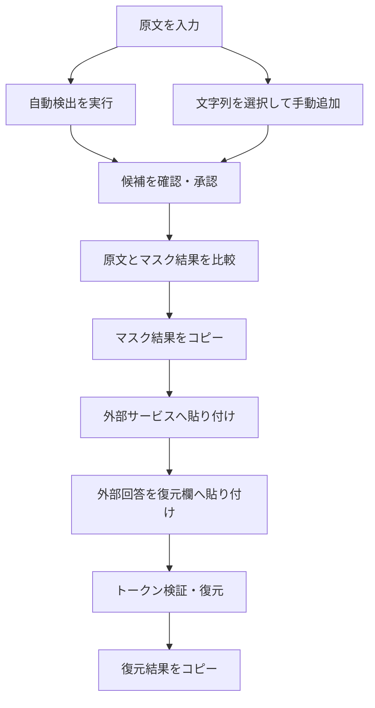
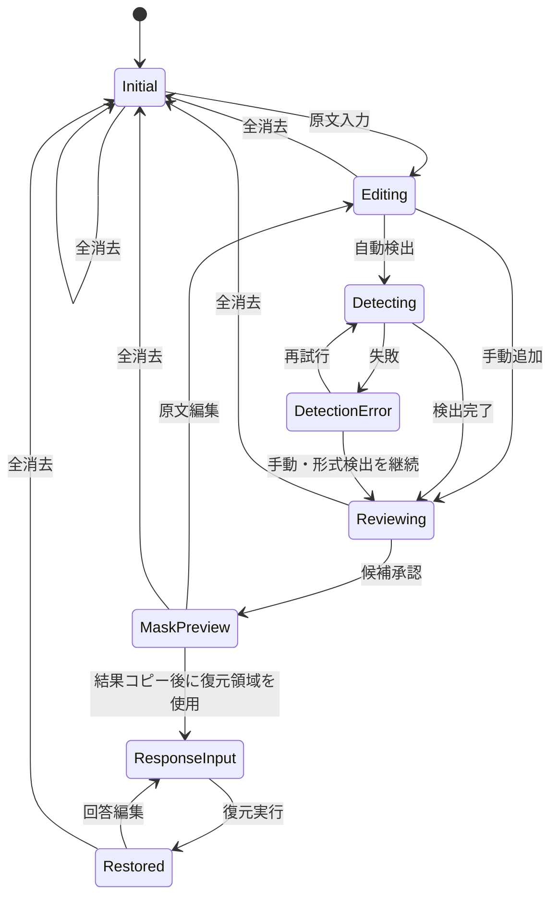

# Local PII Masker MVP 画面設計仕様書

## 1. 文書情報

| 項目 | 内容 |
| --- | --- |
| 対象 | Local PII Masker MVP |
| 文書種別 | 画面設計仕様書 |
| ステータス | 初版 |
| 対象端末 | PC |
| 対象ブラウザ | Google Chrome最新版、Microsoft Edge最新版 |
| 関連文書 | [MVP要件定義](requirements.md)、[アーキテクチャ方針](architecture.md) |

## 2. 目的

本書は、MVP要件をPC向けWeb画面へ落とし込むため、画面構成、表示項目、操作、状態変化、メッセージ、アクセシビリティおよび画面単位の受入条件を定義する。

MVPは複数ページへ分割せず、原文入力から外部回答の復元までを1ページのワークスペースで完結させる。

## 3. 画面設計方針

1. **確認してから外部へ渡す**  
   自動検出結果をそのまま確定せず、ユーザーが候補を確認できる構成とする。

2. **原文とマスク結果を混同させない**  
   原文は編集可能、マスク結果は読み取り専用とし、表示状態をタブと見出しで明示する。

3. **原文を誤ってコピーしにくくする**  
   主要なコピー操作はマスク結果側にのみ配置する。原文入力欄の標準的な選択・コピーは妨げないが、アプリ独自のコピー按钮は設けない。

4. **同一文字列の一括適用を明示する**  
   手動追加時および候補一覧で、対象文字列の出現数を表示する。

5. **AIが利用できなくても操作を継続できる**  
   モデル取得やNER推論が失敗しても、原文入力、手動追加、正規表現検出、マスク生成、復元を利用可能とする。

6. **セッション内処理であることを常時認識できる**  
   ユーザーデータを保存しないことと、ページ更新・終了で消去されることを画面上に表示する。

7. **自動検出は完全ではないことを明示する**  
   コピー前に、検出漏れがないかユーザー自身で確認する必要があることを表示する。

## 4. 画面一覧

MVPの通常画面は1画面とする。モーダル、ポップオーバーを補助画面として使用する。

| ID | 名称 | 種別 | 用途 |
| --- | --- | --- | --- |
| SCR-01 | マスキングワークスペース | メイン画面 | 原文入力、検出候補管理、マスク結果確認、回答復元 |
| DLG-01 | 手動追加ダイアログ | モーダル | 選択文字列をマスク対象へ追加 |
| DLG-02 | 全消去確認ダイアログ | モーダル | セッションデータを消去 |
| DLG-03 | マスク対象0件コピー確認 | モーダル | 原文と同一のマスク結果をコピーする際の確認 |
| POP-01 | 手動追加起動ポップオーバー | ポップオーバー | 原文上で選択した文字列を手動追加へ進める |
| TST-01 | トースト通知 | 一時通知 | コピー成功、候補追加、エラー等の結果通知 |

ルーティングによる画面遷移は行わない。

## 5. 基本利用フロー



## 6. メイン画面全体構成

### 6.1 PC標準レイアウト

```text
┌────────────────────────────────────────────────────────────────────────────┐
│ Local PII Masker     [ブラウザ内処理] [保存されません]       [すべて消去] │
├────────────────────────────────────────────────────────────────────────────┤
│ 入力内容は保存されません。再読み込み・タブ終了で作業内容は失われます。   │
├───────────────────────────────────────────────┬────────────────────────────┤
│ テキストワークスペース                        │ マスク対象                  │
│                                               │                            │
│ [原文] [マスク結果]                           │ [すべて][未確認][有効][0件]│
│ ┌───────────────────────────────────────────┐ │ [候補を検索________]       │
│ │                                           │ │                            │
│ │ 原文エディター／マスク結果プレビュー      │ │ □ 山田太郎                 │
│ │                                           │ │   人名・3か所・AI検出      │
│ │                                           │ │   [確認] [カテゴリ▼] [...] │
│ └───────────────────────────────────────────┘ │                            │
│ 文字数: 1,240 / 上限未確定                    │ ☑ 090-1234-5678            │
│                                               │   電話番号・1か所・Regex   │
│ [自動検出]  状態: モデル未読込                │                            │
│                                               │                            │
│                  対象3件・置換7か所 [コピー] │                            │
├───────────────────────────────────────────────┴────────────────────────────┤
│ ▾ 外部AI回答のトークンを復元                                           │
│ ┌──────────────────────────────┬───────────────────────────────────────┐ │
│ │ 外部AIの回答                 │ 復元結果                              │ │
│ │                              │                                       │ │
│ │ [貼り付け欄]                 │ [読み取り専用]                        │ │
│ └──────────────────────────────┴───────────────────────────────────────┘ │
│ [復元する] 既知: 3 / 未出現: 1 / 不明: 0              [復元結果をコピー] │
└────────────────────────────────────────────────────────────────────────────┘
```

### 6.2 レイアウト比率

- ページ本体の最大幅は固定せず、PC画面幅を活用する。
- メイン領域は左側のテキストワークスペースを優先し、概ね65%、右側の管理パネルを35%とする。
- 右パネルの推奨幅は360～440pxとする。
- メイン領域の最小高は、標準的な768px高の画面でテキストを十分確認できる値とする。
- 外部回答の復元領域は折りたたみ可能とし、初期状態は閉じる。

## 7. SCR-01 マスキングワークスペース

### 7.1 ヘッダー

| ID | 項目 | 種別 | 仕様 |
| --- | --- | --- | --- |
| HD-01 | アプリ名 | テキスト | `Local PII Masker`を表示する |
| HD-02 | ブラウザ内処理表示 | ステータスバッジ | 「入力内容をアプリサーバーへ送信しない」設計であることを示す |
| HD-03 | 非保存表示 | ステータスバッジ | 「保存されません」を表示する |
| HD-04 | すべて消去 | 危険操作ボタン | DLG-02を開く |

`HD-02`の詳細説明には、AIモデル等の公開資材をネットワークから取得する場合がある一方、原文や対応表は送信しないことを記載する。

### 7.2 セッション注意バナー

初期表示から常時表示する。

表示文言：

> 入力内容は保存されません。ページを再読み込みまたは閉じると、原文、マスク設定、回答、復元結果は失われます。

- 情報レベルのバナーとし、過度な警告色は使用しない。
- 閉じる操作は提供しない。
- ページ内の主要作業領域より上に配置する。

## 8. テキストワークスペース

### 8.1 表示タブ

| タブ | 編集 | 目的 |
| --- | --- | --- |
| 原文 | 可 | 原文入力、編集、対象箇所確認、手動選択 |
| マスク結果 | 不可 | マスク後テキストの確認、コピー |

- 初期タブは「原文」とする。
- タブ切り替えで原文、候補、マスク設定を変更しない。
- 選択中のタブを色だけでなく下線、背景、`aria-selected`で示す。
- 原文が空の場合、「マスク結果」タブは選択できるが、空状態を表示する。

### 8.2 原文エディター

#### 8.2.1 初期状態

プレースホルダー：

> 個人情報をマスキングしたい日本語テキストを入力または貼り付けてください。

補助文：

> 入力内容はブラウザのメモリ内だけで処理され、保存されません。

#### 8.2.2 入力仕様

- 複数行テキストを入力・貼り付けできる。
- 原文は入力時にUnicode NFCへ正規化する。
- 文字数を常時表示する。
- 上限未確定の間は、暫定目標10,000文字を超えた時点で注意を表示する。
- 上限超過時も原文を勝手に切り捨てない。
- 入力値をHTMLとして解釈しない。
- 入力内容をURL、ブラウザ履歴、ログへ含めない。

#### 8.2.3 ハイライト

登録済みマスク対象の出現箇所を原文上でハイライトする。

- 有効な対象：カテゴリ付きの実線ハイライト
- 未確認候補：破線または薄いハイライト
- 無効な対象：原則ハイライトしない。管理パネルで項目を選択した場合だけ一時表示する
- 0件対象：原文上には表示しない
- 同じ位置で複数候補が重なる場合は、最長一致で実際に適用される範囲を優先表示する
- 色だけに依存せず、選択時にカテゴリ名と対象文字列をツールチップまたはアクセシブルな説明で提示する

#### 8.2.4 原文編集後の挙動

- 入力変更ごとに、登録済み対象の出現数とマスク結果を再計算する。
- AI・正規表現の再スキャンは自動実行しない。
- 前回スキャン後に原文が変更された場合、次の表示を行う。

> 原文が変更されています。新しい個人情報を検出するには、もう一度「自動検出」を実行してください。

- 出現数が0になった対象は管理パネルに残す。

### 8.3 文字列選択と手動追加

#### 8.3.1 手動追加の起動

原文上で空白以外の文字列を選択した場合、選択範囲の近くまたはエディター上部に`POP-01`を表示する。

```text
「山田太郎」を選択中    [マスク対象に追加]
```

- 選択解除、Escキー、原文タブ以外への移動で閉じる。
- 空文字または空白のみの場合は表示しない。
- 既存の対象文字列と同一の場合、ボタン表示を「登録済みの項目を表示」に変更する。
- 改行を含む選択はMVPでは登録不可とし、理由を表示する。
- 選択文字列の先頭・末尾の空白は対象から除外し、除外後の文字列を確認画面に表示する。

#### 8.3.2 手動追加確認

`マスク対象に追加`を押すと`DLG-01`を表示する。

手動追加はユーザーが明示的に選択しているため、登録完了後は初期状態を「有効」とする。

### 8.4 マスク結果プレビュー

- 読み取り専用とする。
- マスクトークンをカテゴリ別にハイライトする。
- トークン上へポインターを置いた場合、カテゴリ、表示名、出現元の元文字列を表示できる。ただし、支援技術でも同じ情報へアクセスできること。
- マスク対象が0件の場合、原文と同じテキストを表示し、次の注意を表示する。

> 現在、有効なマスク対象はありません。マスク結果は原文と同じ内容です。

- マスク結果の下部に以下を表示する。
  - 有効な対象文字列数
  - 置換箇所数
  - 未確認候補数
  - 0件対象数

コピー前注意：

> 自動検出はすべての個人情報を検出できるとは限りません。コピー前に原文とマスク結果を確認してください。

## 9. 自動検出操作

### 9.1 自動検出ボタン

| 状態 | 表示 | 操作 |
| --- | --- | --- |
| 原文なし | `自動検出` | 無効 |
| 実行可能 | `自動検出` | 有効 |
| モデル取得中 | `モデルを準備中…` | 主ボタン無効、中止を表示 |
| 検出中 | `検出中…` | 主ボタン無効、中止を表示 |
| 完了 | `再検出` | 有効 |
| エラー | `再試行` | 有効 |

キーボード操作は通常のTab移動とEnter／Spaceによる実行を必須とする。独自ショートカットはMVPでは設けない。

### 9.2 進行表示

以下のフェーズを表示する。

1. 正規表現で検出中
2. AIモデルを確認中
3. AIモデルを取得中
4. AIモデルを初期化中
5. 日本語NERを実行中
6. 検出候補を統合中

モデル取得が必要な場合は、取得容量を把握できる範囲で表示する。

```text
AIモデルを取得しています  124 MB / 279 MB  44%
```

容量を取得できない場合は、不確かな数値を表示せずインジケーターのみ表示する。

### 9.3 検出完了

完了後、トーストと管理パネル内のサマリーで結果を表示する。

> 自動検出が完了しました。新規候補8件、既存項目との統合2件。

自動検出候補の初期状態は「未確認・無効」とする。ユーザーが承認した項目だけをマスク結果へ反映する。

### 9.4 検出エラー

- 原文、既存候補、マスク対象を保持する。
- 正規表現結果が得られている場合は保持する。
- NERだけが失敗した場合は、正規表現・手動追加を継続利用できる。
- エラー表示に原文や対象文字列を含めない。

表示例：

> AIモデルを読み込めませんでした。ネットワーク状態を確認して再試行してください。手動追加と形式検出は引き続き利用できます。

## 10. マスク対象管理パネル

### 10.1 パネルヘッダー

以下を表示する。

- 見出し：`マスク対象`
- 全項目数
- 未確認件数
- 有効件数
- 一括操作メニュー

一括操作メニューのMVP対象：

- 未確認候補をすべて承認
- 未確認候補をすべて除外
- 0件の項目をすべて削除

「未確認候補をすべて承認」は誤検出を一括反映する危険があるため、確認ダイアログを表示するか、MVP初版では提供しない判断も可とする。初期実装では個別確認を優先する。

### 10.2 フィルター

| フィルター | 対象 |
| --- | --- |
| すべて | 全項目 |
| 未確認 | 自動検出後に未確認の項目 |
| 有効 | マスク結果へ反映中の項目 |
| 無効 | 確認済みだがマスクしない項目 |
| 0件 | 現在の原文に存在しない項目 |

カテゴリ、検出元による追加フィルターはMVP後の候補とする。

### 10.3 検索

- 対象文字列、表示トークン、カテゴリ名で絞り込める。
- 入力内容は管理パネル内だけで利用し、保存しない。
- 検索結果0件の場合は空状態を表示する。

### 10.4 項目カード

項目ごとに以下を表示する。

| ID | 項目 | 仕様 |
| --- | --- | --- |
| ME-01 | 状態 | 未確認、有効、無効、0件をテキストとアイコンで表示 |
| ME-02 | 対象文字列 | 全文または適切に省略して表示。全文確認手段を提供 |
| ME-03 | 表示トークン | `[人名_1]`等のユーザー向け表示名 |
| ME-04 | カテゴリ | セレクトボックスで変更可能 |
| ME-05 | 出現数 | `3か所`の形式で表示 |
| ME-06 | 検出元 | `AI`、`形式検出`、`手動`のチップを複数表示可能 |
| ME-07 | 信頼度 | 取得可能なAI候補のみ参考値として表示 |
| ME-08 | 確認操作 | 未確認候補に`マスクする`、`除外`を表示 |
| ME-09 | 有効切替 | 確認済み項目を有効／無効にする |
| ME-10 | 該当箇所確認 | 原文タブへ移動し、最初の該当箇所をフォーカス |
| ME-11 | 削除 | 管理一覧と対応表から削除 |

項目例：

```text
未確認
山田太郎
[人名_1]  人名  3か所
AI検出  信頼度94%
[マスクする] [除外] [該当箇所]
```

### 10.5 状態別操作

#### 未確認

- `マスクする`：確認済み・有効へ変更
- `除外`：確認済み・無効へ変更
- カテゴリ変更可
- 削除可

#### 有効

- マスク結果へ即時反映
- 無効へ切り替え可
- カテゴリ変更時はトークン表示を再評価する
- 削除可

#### 無効

- マスク結果へ反映しない
- 有効へ再切り替え可
- 原文上の該当箇所確認可
- 削除可

#### 0件

- 状態ラベル`原文内に0件`
- 有効／無効設定は保持する
- 削除可
- 同じ文字列が原文へ再入力された場合は自動的に出現数を更新する

### 10.6 項目選択と該当箇所移動

- `該当箇所`操作で原文タブを表示し、最初の出現箇所へスクロールする。
- 複数箇所ある場合は`前へ`、`次へ`で巡回できる。
- `1 / 3`のように現在位置を表示する。
- 最長一致により実際には短い対象が適用されない重複箇所について、出現数と適用数を区別する必要がある場合は、次の形式を使用する。

```text
文字列出現: 4か所 / 実際の置換: 2か所
```

## 11. DLG-01 手動追加ダイアログ

### 11.1 表示項目

```text
マスク対象に追加

対象文字列
山田太郎

原文内の出現数
3か所すべてがマスク対象になります。

カテゴリ
[人名 ▼]

表示トークン
[人名_1]（自動生成）

[キャンセル] [追加してマスク]
```

### 11.2 入力・操作仕様

- 対象文字列は原則読み取り専用とする。
- カテゴリは必須とする。
- 初期カテゴリは`その他`とし、簡易推定できる場合でもユーザーが確認できること。
- `追加してマスク`で項目を登録し、有効状態にする。
- 登録後は対象カードを管理パネル上で選択状態にする。
- Escで閉じる。
- フォーカスをダイアログ内に閉じ込め、閉じた後は起動元へ戻す。

### 11.3 重複時

同一文字列が登録済みの場合、新規登録しない。

表示例：

> この文字列はすでに登録されています。既存の項目を表示します。

`既存項目を表示`でダイアログを閉じ、管理パネルの該当項目へフォーカスする。

## 12. マスク結果のコピー

### 12.1 コピーボタン

- ラベル：`マスク結果をコピー`
- 原文が空の場合は無効。
- コピー対象は、その時点で表示されている最新のマスク結果とする。
- 原文タブ表示中でも、ボタン名を明示したうえでマスク結果をコピーできる。配置はマスク結果のサマリー付近とする。

### 12.2 コピー成功

トースト表示：

> マスク結果をコピーしました。対象3件、置換7か所。

スクリーンリーダーへも通知する。

### 12.3 対象0件時

有効なマスク対象が0件の場合は`DLG-03`を表示する。

```text
マスク対象がありません

現在のマスク結果は原文と同じ内容です。
本当にコピーしますか？

[キャンセル] [原文と同じ内容をコピー]
```

この確認により、原文の意図しない外部持ち出しを抑止する。

### 12.4 コピー失敗

> クリップボードへコピーできませんでした。ブラウザの権限を確認し、テキストを選択してコピーしてください。

コピー失敗時も原文やマスク設定を変更しない。

## 13. 外部AI回答の復元領域

### 13.1 開閉

- 見出し：`外部AI回答のトークンを復元`
- 初期状態は折りたたむ。
- マスク結果を初めてコピーした後、見出し付近へ「次の操作」表示を出してもよい。
- 開閉状態はセッション内だけで保持する。

### 13.2 レイアウト

PCでは左右2列とする。

| 左側 | 右側 |
| --- | --- |
| 外部AIの回答入力欄 | 復元結果プレビュー |
| 編集可能 | 読み取り専用 |
| 貼り付け、修正可 | 既知トークン置換後の結果 |

### 13.3 外部回答入力

プレースホルダー：

> 外部の生成AIなどから返された回答を貼り付けてください。

- 原文やマスク結果を自動挿入しない。
- 文字数を表示する。
- 入力内容はセッション内だけで保持する。

### 13.4 復元操作

- ボタン：`トークンを復元`
- 回答が空の場合は無効。
- 対応表が空の場合は無効とし、次を表示する。

> 復元に使用できるマスクトークンがありません。先にマスク対象を作成してください。

- 既知トークンはすべて元文字列へ置換する。
- 不明トークンは変更せず残す。
- 復元結果は再編集不可とする。

### 13.5 トークン検証サマリー

復元実行後、以下を表示する。

| 指標 | 意味 | 重大度 |
| --- | --- | --- |
| 確認できた既知トークン | 対応表にあり、回答内に存在した種類数 | 正常情報 |
| 回答内で未出現 | 対応表にはあるが回答内にない種類数 | 参考情報 |
| 不明トークン | マスク形式に見えるが対応表にない種類数 | 警告 |
| 復元箇所 | 実際に置換した総出現数 | 正常情報 |

未出現トークンは回答内容によって正常に発生するため、エラー表示にしない。

表示例：

```text
既知3種類を5か所復元しました。
回答内で未出現: 2種類 / 不明トークン: 1種類
```

### 13.6 復元結果のコピー

- ボタン：`復元結果をコピー`
- 復元実行前または結果が空の場合は無効。
- 成功時：

> 復元結果をコピーしました。

- 不明トークンが残っている場合は、コピー可能とするがボタン付近へ警告を表示する。

> 不明なトークンが1種類残っています。内容を確認してください。

## 14. DLG-02 全消去確認ダイアログ

### 14.1 表示

```text
作業内容をすべて消去しますか？

次のデータをこの画面から消去します。
・原文
・検出候補とマスク対象
・トークン対応表
・外部AIの回答
・復元結果

AIモデルやアプリ資材のブラウザキャッシュは消去しません。
この操作は取り消せません。

[キャンセル] [すべて消去]
```

### 14.2 完了後

- セッション状態を初期化する。
- 原文タブを選択する。
- 原文エディターへフォーカスする。
- トースト表示：

> 作業内容を消去しました。

## 15. ページ離脱

原文、候補、外部回答のいずれかが存在する場合、ブラウザで可能な範囲で離脱確認を行う。

アプリ内には常時、保存されないことを表示する。ブラウザ標準確認の文言は制御できないことを前提とする。

## 16. 主要な画面状態

### 16.1 状態一覧

| 状態ID | 状態 | 主な表示 |
| --- | --- | --- |
| ST-01 | 初期 | 空の原文エディター、検出ボタン無効、候補なし |
| ST-02 | 入力中 | 文字数、自動検出ボタン有効 |
| ST-03 | 検出準備中 | モデル取得・初期化進捗、中止 |
| ST-04 | 検出中 | 推論進捗、中止、既存データ保持 |
| ST-05 | 候補確認中 | 未確認候補一覧、承認・除外操作 |
| ST-06 | マスク確認中 | 原文／結果切替、ハイライト、コピー |
| ST-07 | 原文変更済み | 再検出を促す注意、既存項目の出現数再計算 |
| ST-08 | NERエラー | 再試行、Regex・手動操作継続 |
| ST-09 | 回答入力中 | 外部回答入力、復元ボタン有効 |
| ST-10 | 復元完了 | 復元結果、検証サマリー、コピー |

### 16.2 状態遷移



## 17. 空状態

### 候補なし

> 検出候補はありません。原文を入力して「自動検出」を実行するか、原文中の文字列を選択して手動追加してください。

### 自動検出結果0件

> 新しい候補は検出されませんでした。自動検出は完全ではないため、原文を確認し、必要な文字列を手動追加してください。

### フィルター結果0件

> 条件に一致するマスク対象はありません。

### マスク結果なし

> 原文が入力されていません。

### 復元結果なし

> 外部AIの回答を貼り付けて「トークンを復元」を実行してください。

## 18. メッセージ設計

### 18.1 表示方式

| 種別 | 用途 | 表示位置 |
| --- | --- | --- |
| インライン情報 | 非保存、コピー前注意、再検出案内 | 関連領域内 |
| インライン警告 | 不明トークン、上限超過、0件コピー | 関連操作付近 |
| インラインエラー | モデル取得、推論、入力不備 | 関連領域上部 |
| トースト | コピー成功、追加成功、消去成功 | 画面右下等 |
| モーダル | 取り消せない操作、危険なコピー | 画面中央 |

### 18.2 文言原則

- 原因と次に取れる操作を示す。
- 「安全」「匿名化」「完全」などを断定しない。
- エラーメッセージへ原文、対象文字列、対応表を含めない。
- 技術的な例外名やスタックトレースをユーザーへ表示しない。

## 19. アクセシビリティ

- 主要操作をキーボードだけで完了できること。
- タブ、ダイアログ、折りたたみ、進捗表示に適切なARIA属性を設定すること。
- フォーカス位置を常に視認できること。
- モーダルを開いた場合はフォーカスを内部に閉じ、閉じた後は起動元へ戻すこと。
- トースト、コピー結果、検出完了をライブリージョンで通知すること。
- 状態を色だけで区別せず、ラベルとアイコンを併用すること。
- カテゴリ色は補助情報とし、色覚特性が異なっても識別できるコントラストを確保すること。
- 原文とマスク結果のタブを支援技術から識別できること。
- テキスト領域には明示的なラベルを付与すること。
- ボタン内のアイコンだけで意味を表さず、アクセシブルネームを付与すること。

## 20. PC表示と狭幅時の挙動

### 20.1 正式対象

- 推奨表示幅：1280px以上
- 最小評価幅：1024px
- 推奨表示高：768px以上

### 20.2 1024～1199px

- 右パネル幅を縮小する。
- 項目カードの補助情報を複数行に折り返す。
- 外部回答の復元領域は左右2列を維持できない場合、上下2段へ切り替える。

### 20.3 1024px未満

スマートフォン、タブレットはMVP正式対応外とするが、画面が破綻しないよう以下を行う。

- メイン領域を上下1列へ切り替える。
- マスク対象パネルをテキスト領域の下へ配置する。
- 重要操作を画面外へ隠さない。
- 正式な操作性・性能は保証しない。

## 21. ビジュアル方針

- 業務ツールとして、装飾より可読性と状態識別を優先する。
- 背景、境界、文字のコントラストを十分確保する。
- 原文とマスク結果を同じ外観にせず、編集可能／読み取り専用を背景、見出し、カーソルで区別する。
- 主操作は`自動検出`と`マスク結果をコピー`とする。
- `すべて消去`は危険操作として主操作と視覚的に区別する。
- カテゴリは色に加え、`人名`、`住所`などのテキストラベルを必ず表示する。
- 長文確認を妨げる過度なアニメーションを使用しない。

## 22. UIコンポーネント構成案

```text
AppShell
├─ AppHeader
│  ├─ ProcessingBadge
│  ├─ NoPersistenceBadge
│  └─ ClearSessionButton
├─ SessionNotice
├─ MainWorkspace
│  ├─ TextWorkspace
│  │  ├─ ViewTabs
│  │  ├─ OriginalTextEditor
│  │  ├─ MaskedTextPreview
│  │  ├─ SelectionActionPopover
│  │  ├─ TextStatusBar
│  │  ├─ DetectionControls
│  │  └─ CopyMaskedTextButton
│  └─ MaskEntryPanel
│     ├─ EntrySummary
│     ├─ EntryFilters
│     ├─ EntrySearch
│     ├─ MaskEntryList
│     └─ MaskEntryCard
├─ RestoreSection
│  ├─ ExternalResponseEditor
│  ├─ RestoreButton
│  ├─ TokenValidationSummary
│  ├─ RestoredResponsePreview
│  └─ CopyRestoredResponseButton
├─ ManualAddDialog
├─ ClearSessionDialog
├─ ZeroMaskCopyDialog
└─ ToastRegion
```

## 23. 画面単位の受入条件

### UI-AC-01 初期表示

初期表示時に原文、候補、回答が空で、自動検出とコピーが適切に無効化され、非保存の注意が表示されること。

### UI-AC-02 原文入力

原文を入力すると文字数が更新され、自動検出が実行可能になること。

### UI-AC-03 手動追加

原文中の文字列を選択し、カテゴリを指定して追加すると、同一文字列の全出現数が示され、有効なマスク対象として登録されること。

### UI-AC-04 自動検出候補

自動検出した候補が未確認状態で表示され、ユーザーが承認するまでマスク結果へ反映されないこと。

### UI-AC-05 候補管理

候補の承認、除外、カテゴリ変更、有効切替、削除がマスク結果と一覧へ即時反映されること。

### UI-AC-06 原文と結果の切り替え

タブ切り替え後も原文と設定が変化せず、原文は編集可能、マスク結果は読み取り専用であること。

### UI-AC-07 ハイライトと移動

管理パネルの項目から原文上の該当箇所へ移動でき、複数箇所を順に確認できること。

### UI-AC-08 最長一致の表示

`山田`と`山田太郎`が登録されている場合、マスク結果およびハイライトが最長一致の適用結果と一致すること。

### UI-AC-09 コピー防止策

有効なマスク対象が0件の場合、原文と同じ内容をコピーする前に確認が表示されること。

### UI-AC-10 検出中表示

モデル取得・初期化・検出の状態が表示され、処理中も既存の原文と設定が消失しないこと。

### UI-AC-11 NER障害時の継続

NER失敗時にエラーと再試行方法が表示され、手動追加と形式検出を継続できること。

### UI-AC-12 復元

外部回答を貼り付けて復元すると、既知トークンが置換され、既知、未出現、不明の状態が区別して表示されること。

### UI-AC-13 全消去

確認後に全セッションデータが初期化され、モデルキャッシュは消去対象ではないことが画面上で明示されること。

### UI-AC-14 キーボード操作

原文入力、検出、候補確認、タブ切り替え、コピー、回答復元、全消去をキーボードで操作できること。

### UI-AC-15 非保存表示

ユーザーが作業中のどの状態でも、ページ終了時にデータが失われることを確認できること。

## 24. 実装前に確定する項目

1. マスクトークンのユーザー向け表示形式
2. カテゴリごとの視覚表現
3. 原文エディターのハイライト実装方式
4. 手動追加で許容する最大文字列長
5. 自動検出処理の中止可否と中止単位
6. 未確認候補の一括承認をMVPに含めるか
7. 検出モデルの取得容量を事前表示できるか
8. `文字列出現数`と`実際の置換数`を常時分けて表示するか
9. 1024px幅における最終レイアウト
10. 主要カテゴリとカテゴリ名の最終表記

## 25. MVP初期実装の優先順

1. 画面シェル、ヘッダー、セッション注意
2. 原文エディターとマスク結果タブ
3. 手動追加ダイアログ
4. マスク対象管理パネル
5. 最長一致を反映したハイライトとマスクプレビュー
6. マスク結果コピーと0件確認
7. 正規表現検出と候補確認UI
8. 外部回答の復元領域
9. NERモデルのロード・進捗・エラーUI
10. アクセシビリティと狭幅時の調整
